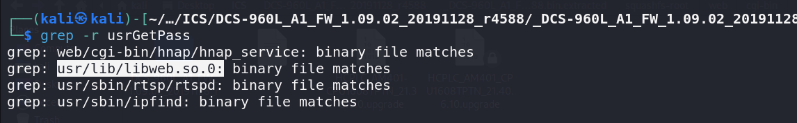
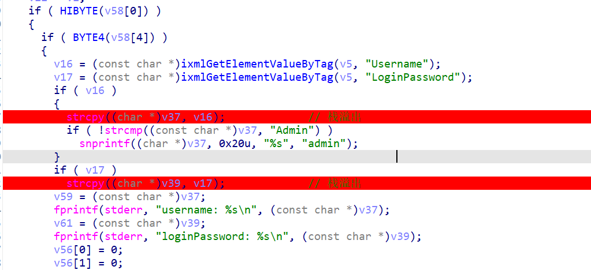
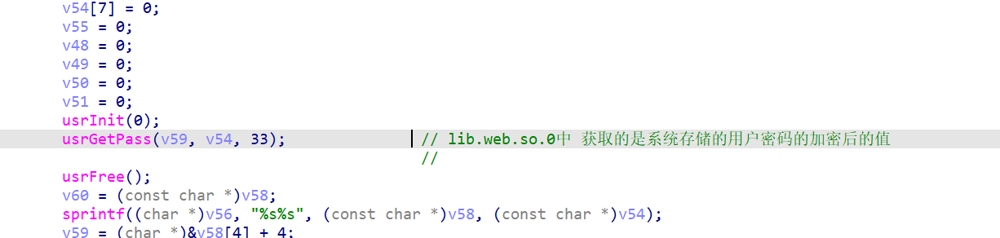
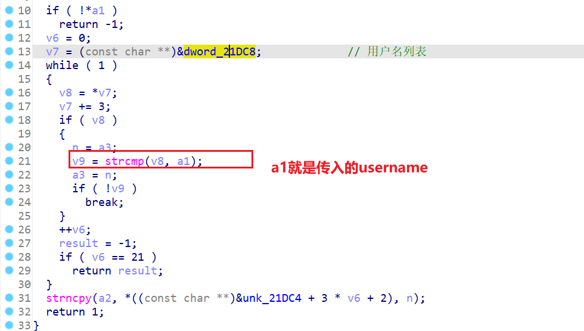

还是这篇：

```
https://wzt.ac.cn/2021/01/17/DCS-960L/
```


漏洞描述：

> DCS-960L 在处理 HNAP 登录请求时，对于参数 LoginPassword 的处理逻辑错误，攻击者可以构造特殊的登录请求实现登录验证绕过。


eee。。。我就说跟半天没找到点，原来漏洞要结合外部的so中的函数usrGetPass这些：




先梳理一遍登录的验证过程：

先获取了用户输入的Username和LoginPassword，（栈溢出。。。）



然后经过了一系列处理，包括对`usrInit`，`usrGetPass`等



这个`usrGetPass`应该就是获取系统存储的用户密码的加密值（？）感觉可能不大对，先继续看。

这里`usrGetPass`采用的是在username列表中查找用户的userName,返回对应的password。

找到后存储在a2这个buffer返回。这里有个点：v6只能到21！（也就是说设计时认为的用户列表的容量是20(1)）




后面就是

算hmac_md5，校验密码了。

---

感觉这一堆hmac_md5没怎么搞懂逻辑。。。

感觉奇奇怪怪的算回去得到了正确密码的明文？？？

oops，他这个有两个password。。。 usrGetPass得到的是用来hmac的pass，最后算出来的才是login的password。（还是32位。。。）

---


漏洞点就在前面说的，v6==21的时候，就会返回result，也就是 return -1；

（怎么使得v6==21呢？传一个不存在的用户即可。）

重点不在于这个返回值-1，**而是在于不会向a2这个buffer拷贝用户的密码！！！**

也就是

```
usrGetPass(v59, v54, 33);
```

的v54==NULL。


那相当于usrGetPass得到的password就全部为空，`\x00`，

那么如果拿到challenge和public key过后，就能算出login的password了。（或者直接动调得到即可）


怎么拿到challenge和public key呢？动调能看罢？没设备就不深入了。