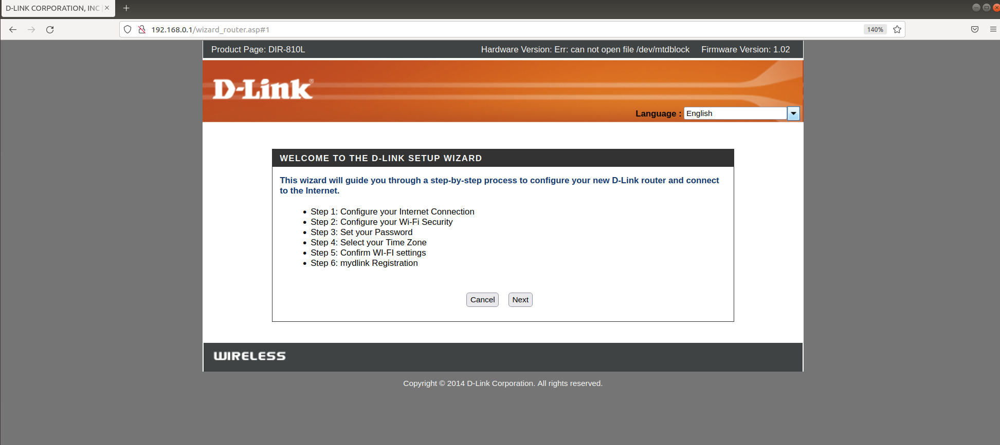
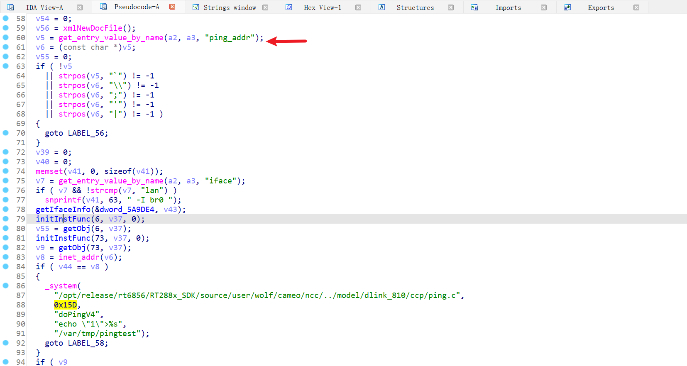
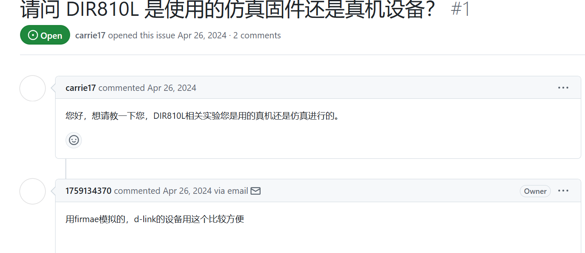
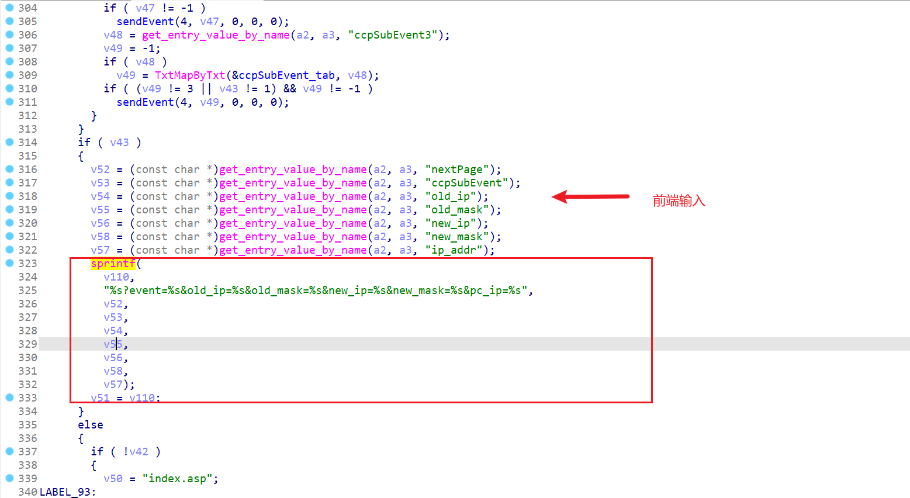

固件下载：

```
https://www.dlinktw.com.tw/techsupport/ProductInfo.aspx?m=DIR-810L
```


```
https://github.com/1759134370/iot/blob/main/D-LINK/DIR-810L.md
```

这个CVE上也只有这一个，


虽然AttifyOS的fat.py也仿真不了。。。


先复现作者的这个。


# `Ping_addr`

经典的ping命令注入了。。。


```bash
iot@attifyos ~/D/I/_/squashfs-root> grep -r ping.ccp
www/tools_vct.asp:			url: "ping.ccp",
www/tools_vct.asp:			url: "ping.ccp",
www/tools_vct.asp:			url: "ping.ccp",
www/tools_vct.asp:			url: "ping.ccp",
www/wizard_router.asp:			url: "ping.ccp",
www/wizard_router.asp:				url: "ping.ccp",
www/wizard_router.asp:			url: "ping.ccp",
www/wizard_router.asp:			url: "ping.ccp",
www/wizard_router.asp:			url: "ping.ccp",
www/wizard_storage.asp:			url: "ping.ccp",
www/goto_mydlink.asp:			url: "ping.ccp",
www/goto_mydlink.asp:			url: "ping.ccp",
www/wizard_mydlink.asp:			url: "ping.ccp",
www/wizard_mydlink.asp:			url: "ping.ccp",
```


等搭好环境来看。


访问

```
http://192.168.0.1:80
```




但这玩意儿就第一次访问了，后面都不行了。。。只开了53的DNS端口。。。

只能寄希望于fat plus能仿真吧。。。


找 ping_addr

```bash
iot@attifyos ~/D/I/_/squashfs-root> grep -r ping_addr
www/tools_vct.asp:			arg: 'ccp_act=ping_v4&ping_addr='+$('#ping_ipaddr').val()
www/tools_vct.asp:			arg: 'ccp_act=ping_v6&ping_addr='+$('#ping6_ipaddr').val()
www/wizard_router.asp:			arg: 'ccp_act=ping_v4&ping_addr='+mdl_srv
www/wizard_router.asp:			arg: 'ccp_act=ping_v4&iface=lan&ping_addr=www.dlink.com'
Binary file sbin/ncc matches
iot@attifyos ~/D/I/_/squashfs-root> 
```


漏洞点在二进制文件`sbin/ncc`中。


mips 32位。

这里传入的ping_addr是可以命令注入的：


虽然感觉有过滤啊，像inet_addr这些，感觉如果不是纯ip会被waf吧？

得实操看看。

呃呃呃，这FirmAE也仿真不了。。。服了。。。

但为啥作者仿真成功了啊。。




# `callback_ccp_get_set` 栈溢出




这就有了个思路：

找有`get_entry_value_by_name`这种从前端HTTP请求读取参数的地方。

