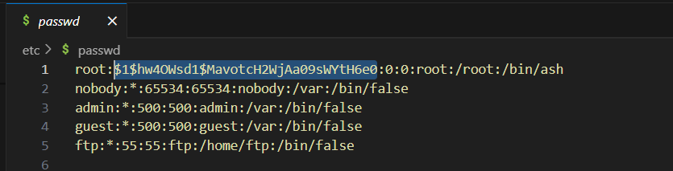
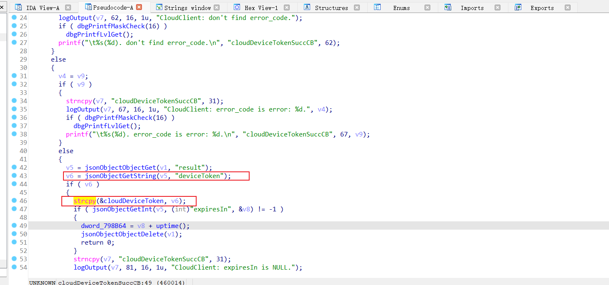
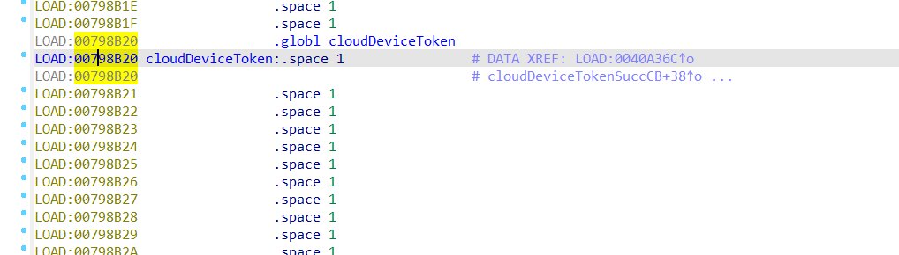

刚好实验室买了这货。

CVE的话list了一个：

> Mercury A15 V1.0 20230818_1.0.3 was discovered to contain a command execution vulnerability via the component cloudDeviceTokenSuccCB

---

# 1. /etc/passwd （❌）

hashcat + rockyou跑不出来

# 2. /bin/dms `cloudDeviceTokenSuccCB` command injection(？) buffer overflow

没看出哪儿有问题啊。。。

感觉这里倒是有个缓冲区溢出：

这个cloudDeviceToken在：

应该是可以溢出覆盖导致DoS的。

等设备到了测一下。

但这怎么从web端传呢？

---

2025年1月16日

开挖！回去之前再挖一挖。

---

这个路由映射很怪，，，

找了个取巧的方法：通过`jsonObjectFromString`来找交叉引用

但还没找到web端映射到bin的方法

# 3. 

