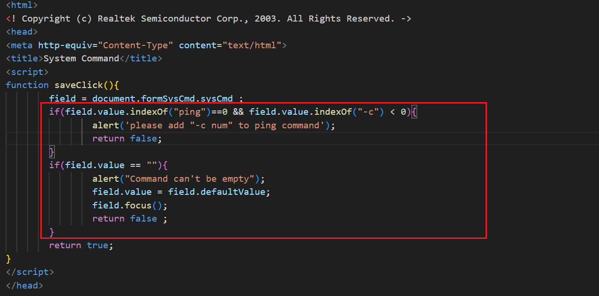
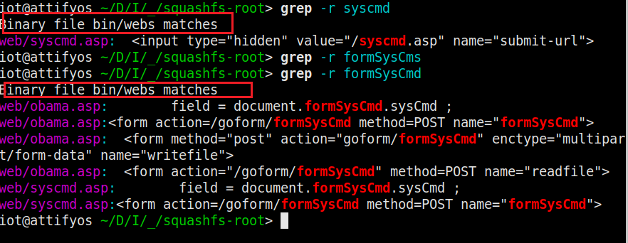
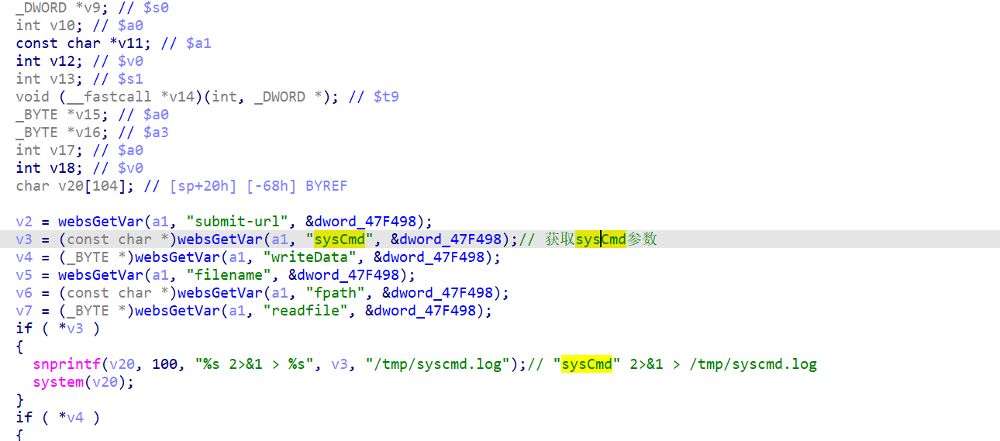
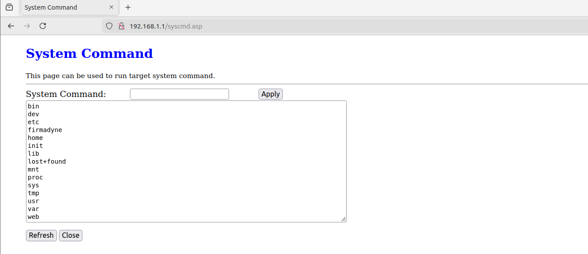

这个漏洞本身有点离谱（楽），但是通过这个学习到了IOT固件环境的模拟。


# 漏洞分析

开始分析。

首先从这里开始：

`web/syscmd.asp`：

这里的逻辑是有一个潜在的任意命令执行的：


我们grep看看这个asp在哪个二进制文件中。




所以这个`bin/webs`就是我们需要分析的二进制程序。

是一个mips32 ELF，IDA7.5有插件可以直接看。（再次感慨，IDA太牛逼了吧！！！）

程序没去符号，还是很好逆的。


直接定位到`formSysCmd`函数。




原理就很清晰了。


# 漏洞复现

fat搭好环境。

```bash
python3 fat.py  ~/Desktop/IOT/RB-1732_TC_v2.0.43.bin
```

访问：`http://192.168.1.1/syscmd.asp`

即可执行命令。

