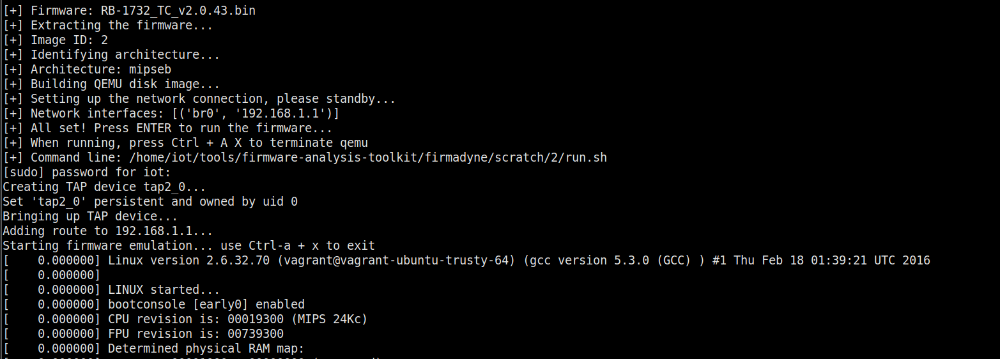
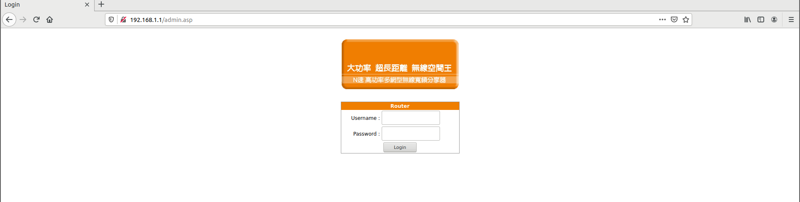
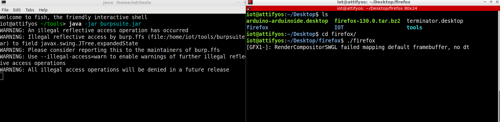
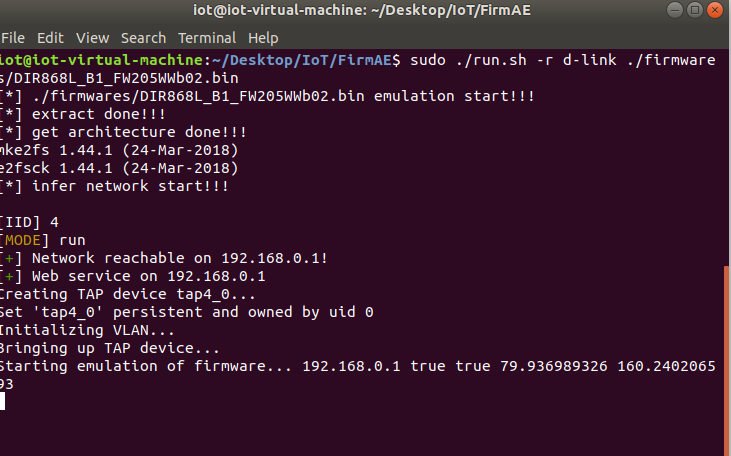
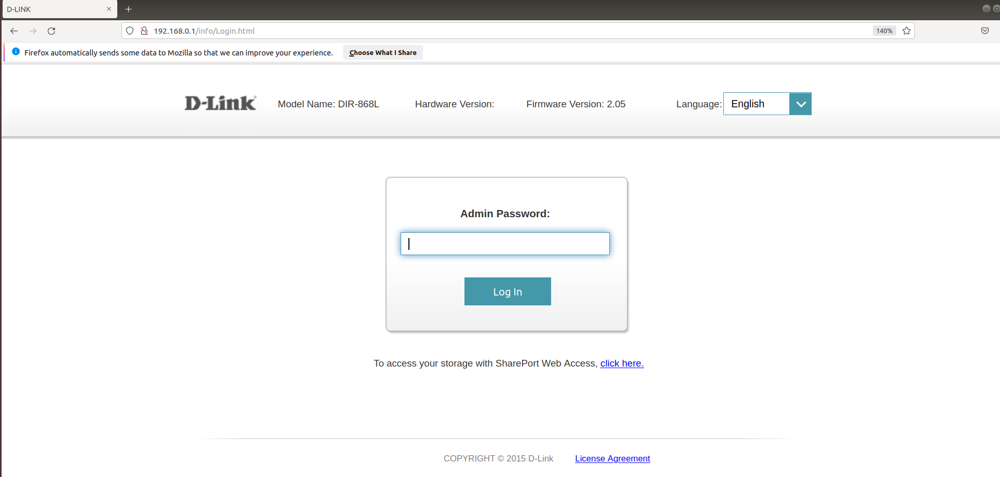

都用Attify！！！

专业的IOT OFFENSIVE工具，fat.py直接可以一键部署固件！

（但我试了三个，只成功了一个。。。）后面再找找有没有更好用的环境。

或者后面用u20搭一个好用点的。

# fat.py

```
iot@attifyos ~/t/firmware-analysis-toolkit> python3 fat.py  ~/Desktop/IOT/RB-1732_TC_v2.0.43.bin
```




访问给的`192.168.1.1`




# burpsuite && firefox

attify原本的firefox版本太低，没办法跑proxy，

而且**不能**apt upgrade，好多依赖不能改。。

所以重新下了个中文版的，进入desktop的firefox后，

```
./firefox
```

启动，开代理，bp抓包即可。




虽然把它原来的fish终端弄没了，但不影响。毕竟我用这个也不讲究美观便捷。2333。。。


# firmware-analysis-plus

```
https://github.com/liyansong2018/firmware-analysis-plus
```

试试看怎么样。

可以考虑直接下一个安装好的ubuntu：

```
https://pan.baidu.com/s/1eVNxoLKlqAQHcrSMfI7tQw?pwd=jpy4
```


台式机挂一晚上就下好了2333。。。


# FirmAE

```
https://github.com/pr0v3rbs/FirmAE
```

貌似能仿真D-LINK的主流型号DIR-XXX，试一试。

>  FirmAE significantly increases the emulation success rate (From [Firmadyne](https://github.com/firmadyne/firmadyne)'s 16.28% to 79.36%) with five arbitration techniques.


楽，firmadyne确实好多仿真不了。


FirmAE要用ubuntu18.04。

倒不嫌麻烦，毕竟IoT最重要的就是环境的搭建。。。


但为啥还是仿真不了啊。。。

woc，能仿真。。。 得等蛮久，才能配好网卡：

```
sudo ./init.sh
sudo ./run.sh -r xxx xxx,bin
```







仿真成功一个就拍**运行时**快照，分析完后删掉就行~